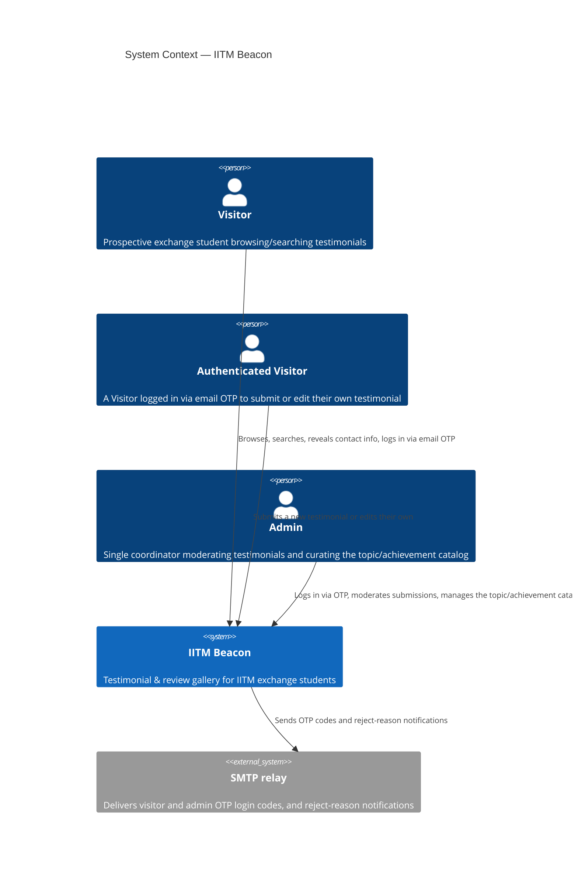
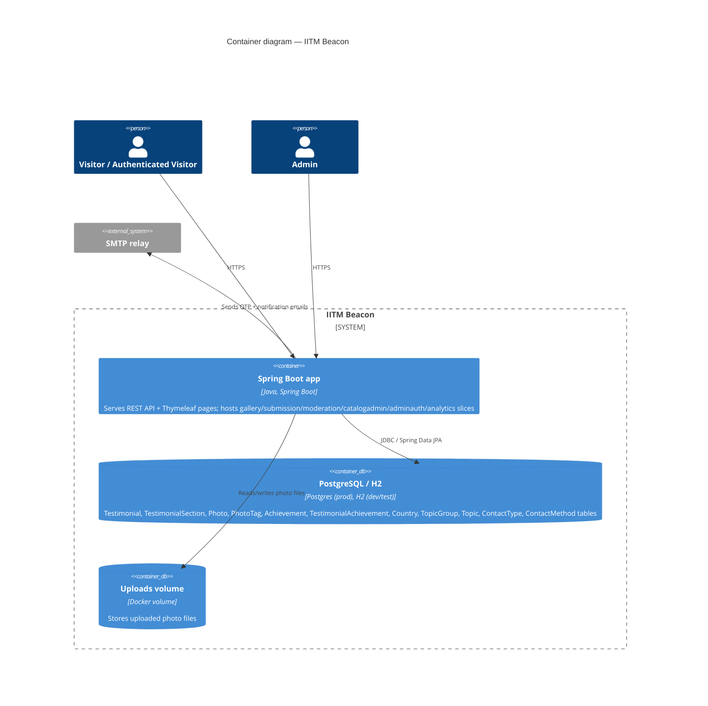
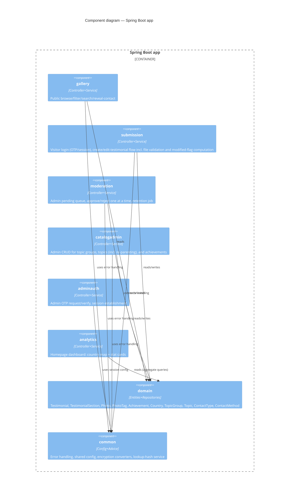
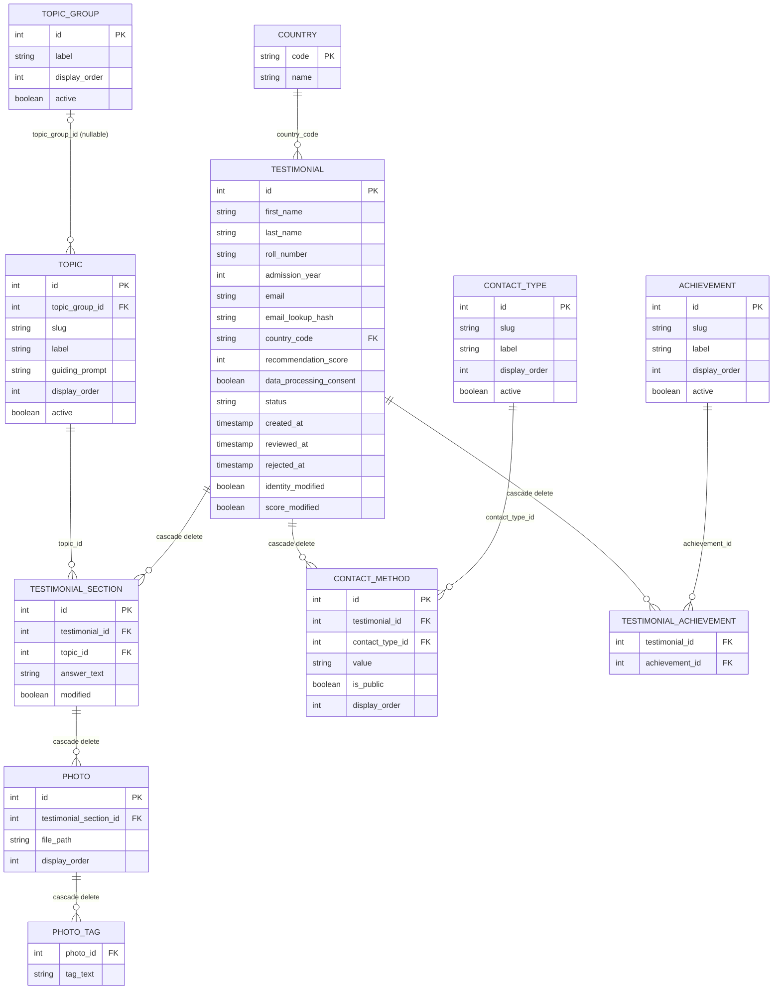

# Architecture

> **Locked — approved baseline (2026-09-10).** Reviewed for consistency across `scope.md`,
> `nfr.md`, `use-cases.md`, `decisions.md`, and `api-spec.yaml`. AI agents: do not edit this
> file — wording, structure, or cross-references — without the user's explicit approval first.

This doc assumes the locked baseline — `scope.md`, `nfr.md`, and `use-cases.md`. `api-spec.yaml`
is kept in sync with it. All accepted decisions live in `decisions.md` and are referenced here
by number rather than restated.

## 1. Style

Layered (Controller → Service → Repository → DB), sliced vertically by feature rather than one
monolithic package per layer. A small shared `domain` layer holds the entities/repositories
that multiple slices need to read or write. No slice imports another slice's classes directly —
only `domain` and `common` (decision 9). This is what makes each slice independently
implementable, addable, or removable.

## 2. C4 diagrams

### 2.1 Context



A future integration with a separate sibling service is anticipated (decision 16) but is not
part of this system's current context, so it isn't modeled here.

### 2.2 Container



### 2.3 Component (inside the Spring Boot app)



## 3. Package / slice layout

```
com.iitm.beacon
├── common/            Cross-cutting: @RestControllerAdvice error handling, shared
│                      error-response DTO, base exceptions, EncryptedValueConverter (AES,
│                      decision 6, shared by Testimonial.email and ContactMethod.value),
│                      EmailLookupHashService (HMAC-SHA256, decision 6).
├── config/            Spring Security config (SecurityConfig; separate admin and visitor
│                      principals/roles), mail (JavaMailSender) config, @EnableScheduling setup,
│                      multipart/upload size config, env-driven @ConfigurationProperties (admin
│                      OTP ttl/max attempts, visitor OTP ttl/max-attempts/request-rate, photo
│                      count/size limits via PhotoStorageProperties, cleanup cron, encryption
│                      key, HMAC pepper), WebMvcConfig (static `/uploads/**` resource handler —
│                      decision 2, §7).
├── domain/
│   ├── testimonial/   Testimonial, TestimonialSection, Photo, PhotoTag, ContactMethod
│   │                  entities, TestimonialStatus enum, their repositories.
│   ├── country/       Country entity (ISO 3166-1 alpha-2 key), CountryRepository.
│   ├── topic/         TopicGroup, Topic entities (Topic optionally FK'd to a TopicGroup —
│   │                  decision 11), their repositories.
│   ├── contacttype/   ContactType entity (seed-only reference data, decision 5),
│   │                  ContactTypeRepository.
│   └── achievement/   Achievement entity, TestimonialAchievement join entity, repositories.
├── gallery/           Public browse/filter/search/paginate + testimonial detail + photo list
│                      + on-demand contact reveal.
│                      GalleryController, GalleryService, TestimonialCardDto,
│                      TestimonialDetailDto.
├── submission/        Visitor login (email OTP request/verify/session — decision 17),
│                      create/edit-testimonial flow including file upload validation and the
│                      "updated since last approval" flag computation, including the
│                      moderation short-circuit for non-text edits (decision 18).
│                      VisitorAuthController, VisitorOtpService (in-memory, concurrent-safe,
│                      keyed by email — decision 17), SubmissionController, SubmissionService,
│                      TestimonialSubmissionRequest (DTO), PhotoStorageService.
├── moderation/        Admin pending queue, approve/reject one at a time — no bulk actions
│                      (decision 18) — and the rejected-testimonial retention job.
│                      ModerationController, ModerationService, PendingTestimonialDto,
│                      RejectedTestimonialCleanupJob (@Scheduled).
├── catalogadmin/      Admin CRUD for topic groups, topics (incl. re-parenting), and
│                      achievements (decision 9).
│                      CatalogAdminController, CatalogAdminService, TopicGroupDto, TopicDto,
│                      AchievementDto.
├── adminauth/         Admin OTP request/verify, session establishment (decision 4).
│                      AdminAuthController, OtpService (in-memory, single admin).
└── analytics/         Homepage dashboard: country map + achievement/score/topic-group stat
                       cards.
                       AnalyticsController, AnalyticsService (read-only aggregate queries).
```

Why `domain` is separate from the feature slices: entities are read and written across
multiple features (gallery reads approved rows, submission creates/edits them, moderation
transitions their status, catalogadmin curates the reference tables they point at, analytics
aggregates over them). Putting them in one place avoids duplicating JPA mappings per slice;
each feature slice still owns its own controller/service/DTOs.

Slice boundaries follow the bounded contexts `use-cases.md`'s own use-case diagram already
draws — its "Submission" subgraph groups visitor login with create/edit; its "CatalogAdmin"
subgraph is drawn separately from "Moderation" — rather than inventing new ones (decision 9).

## 4. Entity / DB schema



### Country
| column | type | notes |
|---|---|---|
| code | PK, varchar(2) | ISO 3166-1 alpha-2, e.g. `IN`, `US` |
| name | varchar, not null | canonical English short name |

Seeded once, in full, via migration (decision 1) — not grown from submissions.

### TopicGroup
| column | type | notes |
|---|---|---|
| id | PK | |
| label | varchar, not null | shown as the group heading on the form and in the article view |
| display_order | int, not null | ordering among top-level picks |
| active | boolean, not null, default true | hides the group (and, by extension, its topics) from new picks without breaking FK history |

Database-driven reference data, managed via the `catalogadmin` catalog screen (decision 9) —
no code change or redeploy required to add/rename/reorder/deactivate one.

### Topic
| column | type | notes |
|---|---|---|
| id | PK | |
| topic_group_id | FK -> TopicGroup, nullable | `null` = standalone topic (decision 11) |
| slug | varchar, unique, not null | e.g. `academics_teaching` |
| label | varchar, not null | shown as the section subheading |
| guiding_prompt | text, not null | shown as placeholder/help text on the form |
| display_order | int, not null | ordering on the form and in the article view |
| active | boolean, not null, default true | hides from the form without breaking FK history |

Database-driven reference data (decision 11), managed via `catalogadmin`, including
re-parenting (moving a topic between groups, or promoting it to standalone).

### ContactType
| column | type | notes |
|---|---|---|
| id | PK | |
| slug | varchar, unique, not null | e.g. `email`, `whatsapp`, `telegram`, `instagram`, `twitter` |
| label | varchar, not null | placeholder/help text shown on the form |
| display_order | int, not null | |
| active | boolean, not null, default true | |

Seed-only reference data (decision 5) — seeded once via migration; no admin-catalog UI
manages this table (no use case calls for one), so a new contact type is a direct database
edit, same treatment as `Country`.

### Achievement
| column | type | notes |
|---|---|---|
| id | PK | |
| slug | varchar, unique, not null | |
| label | varchar, not null | checkbox label |
| display_order | int, not null | |
| active | boolean, not null, default true | |

Same configurability pattern as `Topic` (decision 11), managed via `catalogadmin`.

### Testimonial
| column | type | notes |
|---|---|---|
| id | PK | |
| first_name | varchar, not null | plain text, admin-only in full (decision 10) |
| last_name | varchar, not null | plain text, admin-only in full (decision 10) |
| roll_number | varchar, not null | plain text, admin-only (decision 10) |
| admission_year | int, not null | plain text, admin-only (decision 10) |
| email | varchar, not null | encrypted at rest via `EncryptedValueConverter` (decision 6); sourced from the visitor's login, never typed on the form |
| email_lookup_hash | varchar, unique, not null | deterministic HMAC-SHA256 of the normalized email (decision 6); used only for equality lookups |
| country_code | FK -> Country, not null | |
| recommendation_score | int, not null, 0-10 | one per testimonial (decision 15) |
| data_processing_consent | boolean, not null | must be true to persist the row (decision 7) |
| status | enum: PENDING / APPROVED / REJECTED, not null, default PENDING | |
| created_at | timestamp, not null | |
| reviewed_at | timestamp, nullable | set on approve or reject by an admin — never touched by the moderation short-circuit (decision 18) |
| rejected_at | timestamp, nullable | drives the 30-day cleanup job (decision 3) |
| identity_modified | boolean, not null, default false | set when any identity field changes since the last approval; always blocks the moderation short-circuit (decision 18) |
| score_modified | boolean, not null, default false | set when `recommendation_score` changes; never blocks the moderation short-circuit by itself — kept only so an admin reviewing the testimonial for another reason can see the score also changed (decision 18) |

Identity is captured as `first_name`/`last_name`/`roll_number`/`admission_year` (decision 10),
not a single combined name field. No `contact_info`/`share_contact_publicly` columns — that's
modeled via `ContactMethod` instead (decision 5). No `text` column — content lives in
`TestimonialSection`. No `User`/admin table: the single admin's email is config (`ADMIN_EMAIL`),
not a DB row (decision 4). No `country_modified`, `achievements_modified`, or
`contacts_modified` columns — changes to `country_code`, `TestimonialAchievement` rows, or any
`ContactMethod` are never tracked, since none of them ever gates moderation (decision 18).

### TestimonialSection
| column | type | notes |
|---|---|---|
| id | PK | |
| testimonial_id | FK -> Testimonial, not null, on-delete cascade | |
| topic_id | FK -> Topic, not null | |
| answer_text | text, not null | |
| modified | boolean, not null, default false | set when an edit changes this section's text *or its photos* (or adds the section); only meaningful — and only ever read — once the testimonial has been approved at least once (before that, its value doesn't affect anything); drives the public "updated" badge and always blocks the moderation short-circuit (decision 18) |

At least one section required per testimonial (decision 12).

### Photo
| column | type | notes |
|---|---|---|
| id | PK | |
| testimonial_section_id | FK -> TestimonialSection, not null, on-delete cascade | (decision 2) |
| file_path | varchar, not null | relative path within the mounted uploads volume |
| display_order | int, not null | ordering within its section, and across the article view |

Count per testimonial and max file size are both enforced in `SubmissionService`, driven by
env vars (decision 2) — not DB constraints.

### PhotoTag
| column | type | notes |
|---|---|---|
| photo_id | FK -> Photo, not null, on-delete cascade | |
| tag_text | varchar, not null | free-form, submitter-entered |

Up to 10 rows per `photo_id`, enforced server-side (decision 2).

### TestimonialAchievement
| column | type | notes |
|---|---|---|
| testimonial_id | FK -> Testimonial, not null, on-delete cascade | |
| achievement_id | FK -> Achievement, not null | |

Composite PK (`testimonial_id`, `achievement_id`).

### ContactMethod
| column | type | notes |
|---|---|---|
| id | PK | |
| testimonial_id | FK -> Testimonial, not null, on-delete cascade | |
| contact_type_id | FK -> ContactType, not null | |
| value | varchar, not null | encrypted at rest via the same `EncryptedValueConverter` as `Testimonial.email` (decision 6) |
| is_public | boolean, not null, default false | set per entry by the submitter (decision 5) |
| display_order | int, not null | |

A submitter may add 0–N entries. Replaces the old single `contact_info` +
`share_contact_publicly` pair (decision 5).

## 5. Admin OTP login flow (decision 4)

Behavior is specified as UC-ADMIN-OTP-REQUEST/UC-ADMIN-OTP-VERIFY in `use-cases.md`; exact
request/response shapes are in `api-spec.yaml`. `OtpService` holds
`{ code, expiresAt, attemptsRemaining }` for the single admin email in
memory — no DB table. TTL and max attempts are `@ConfigurationProperties`, backed by env vars.
No concurrent-session cap. An app restart drops any in-flight OTP request; the admin simply
requests a new one.

## 6. Visitor authentication & session (decision 17)

Behavior is specified as UC-VISITOR-LOGIN in `use-cases.md`.

- `VisitorOtpService` holds OTP state in a concurrent-safe, in-memory store (e.g. a Caffeine
  cache) keyed by the normalized plaintext email, entry shape `{ codeHash, expiresAt,
  attemptsRemaining }`, TTL matched to the OTP's own validity window — never persisted. This is
  the visitor-scale analogue of `OtpService` (section 5): same OTP style, but keyed and
  concurrent-safe since many visitors can hold a live OTP at once, instead of one mutable
  field.
- The OTP *request* endpoint is separately rate-limited per email and per IP (also in-memory,
  e.g. via Bucket4j), and its response is identical whether or not the email has an existing
  testimonial — no enumeration (NFR-VISITOR-OTP-BRUTEFORCE).
- On successful verify, Spring Security establishes a session under a visitor-scoped principal
  (a distinct role from the admin's), and `SubmissionService` calls
  `TestimonialRepository.findByEmailLookupHash(...)` (decision 6) to route to
  UC-CREATE-TESTIMONIAL (nothing found) or UC-EDIT-TESTIMONIAL (found) regardless of that
  testimonial's status.
- TTL, max attempts, and request rate are `@ConfigurationProperties`, backed by env vars,
  configured independently from the admin's own OTP settings.
- An app restart drops any in-flight visitor OTP requests — the visitor simply requests a new
  one; an accepted trade-off given the mechanism stays entirely in-process (decision 17).

## 7. Photo storage and ownership (decision 2)

- Photos are written to a filesystem directory mounted as a Docker volume (e.g.
  `/data/uploads`), separate from the app container's own filesystem.
- `Photo.file_path` stores the path relative to that root.
- Each `Photo` belongs to a `TestimonialSection`, inheriting that section's topic as its
  automatic tag, plus up to 10 free-form `PhotoTag` entries.
- Upload validation (`SubmissionService`/`PhotoStorageService`), all server-side: actual image
  content is checked (not the client-declared `Content-Type` header); count and per-file size
  are enforced against env-configured limits (`beacon.storage.*`, `config/PhotoStorageProperties`).
- Content check: `PhotoStorageService` sniffs the real format via `ImageIO`'s own reader
  detection (`ImageIO.getImageReaders` against an `ImageInputStream`) — no new dependency, and
  no reliance on the client-declared `Content-Type` or filename extension (NFR-UPLOAD-SPOOFING).
- Stored filenames are a random UUID plus the *detected* format's extension, not the client's
  original filename — paths under the public `/uploads/**` prefix stay unguessable from a
  testimonial or photo id.
- Files are served back to any client through a plain Spring static resource handler
  (`config/WebMvcConfig`, a `WebMvcConfigurer` mapping `/uploads/**` to the mounted directory) —
  not a dedicated per-photo endpoint, and not owned by any one feature slice, matching the rest
  of `config`'s cross-cutting role (§3).

## 8. Contact & email encryption, lookup, and reveal (decisions 5, 6)

- `Testimonial.email` and every `ContactMethod.value` are encrypted at the application level
  via a shared `EncryptedValueConverter` (JPA `AttributeConverter`, AES, key from an env var) —
  the only fields treated this way.
- `Testimonial.email` additionally carries `email_lookup_hash` (HMAC-SHA256 with a server-side
  pepper env var — decision 6): a deterministic value used only to answer "does a testimonial
  already exist for this email" (UC-VISITOR-LOGIN). It never round-trips back to plaintext —
  it only proves equality. No other field gets a lookup hash: contact-method values are never
  searched by equality, only decrypted for direct display.
- The gallery's normal list/detail responses never include any `ContactMethod` value or the
  email. They are only decrypted and returned by the dedicated reveal-contact endpoint
  (UC-REVEAL-CONTACT), gated on the testimonial being `APPROVED`, returning only the entries
  with `is_public = true` (type + value).
- Moderation responses do include decrypted contact-method values and the email, since the
  admin needs them to decide (UC-VIEW-PENDING-QUEUE).
- All other fields — including `first_name`, `last_name`, `roll_number`, `admission_year` —
  stay unencrypted, so free-text search (decision 8) keeps working as a plain indexed query.

## 9. Moderation workflow: one-at-a-time review and the "updated since approval" short-circuit (decision 18)

- Moderation is approve/reject one testimonial at a time — there is no bulk-approve/bulk-reject
  action.
- `TestimonialSection.modified`, `Testimonial.identity_modified`, and `Testimonial.score_modified`
  are computed by `SubmissionService` inside the same transaction as an edit-save: each incoming
  value is compared against what's currently stored, and the flag is set `true` if it actually
  changed. A brand-new section added on an edit, or any photo added/removed/replaced within a
  section, also counts as that section being modified. Changes to `country_code`,
  `TestimonialAchievement` rows, or any `ContactMethod` are not tracked at all — there's nothing
  to compute for them.
- **Short-circuit:** if the testimonial's status was already `APPROVED` before this edit, and
  neither `TestimonialSection.modified` (on any section) nor `identity_modified` is set, the
  testimonial stays `APPROVED` — it never goes to `PENDING`, regardless of what else changed
  (score, country, achievements, contacts). `SubmissionService` clears `score_modified` itself,
  immediately, in this case, since nothing entered the queue and nothing needs to stay flagged;
  `reviewed_at` is left untouched, since no human reviewed this change.
- Any other edit — one that touches section text, photos, or identity fields, or one made to a
  testimonial that was `PENDING` or `REJECTED` before the edit — always sets status to
  `PENDING` for full re-moderation, regardless of which fields changed.
- Public exposure stays narrow: only `TestimonialSection.modified` reaches the public detail
  view, rendered as an "updated" badge on the affected subtopic/standalone topic
  (UC-EXPAND-TESTIMONIAL). `identity_modified` and `score_modified` are admin-only, shown in the
  moderation queue (UC-VIEW-PENDING-QUEUE) for whatever *does* still reach it — `score_modified`
  purely as context, since it never causes the item to be there by itself.
- `ModerationService` clears every flag back to `false` as part of a normal approve
  (UC-APPROVE-TESTIMONIAL).
- On reject (UC-REJECT-TESTIMONIAL), `ModerationService` always emails the submitter via the
  existing SMTP relay (same one used for OTP codes) to let them know to log in and fix their
  testimonial, including the admin's reason text in the email when one was given.

## 10. Catalog admin (decision 9)

- `catalogadmin` is a dedicated slice, separate from `moderation`, covering
  UC-MANAGE-TOPIC-GROUPS, UC-MANAGE-TOPICS, and UC-MANAGE-ACHIEVEMENTS.
- `TopicGroup`, `Topic`, and `Achievement` all support create / rename / reorder / deactivate;
  `Topic` additionally supports re-parenting — changing its `topic_group_id`, including to/from
  `null` (standalone).
- Deactivation is always non-destructive: an inactive row stops being offered as a new pick
  (submission form, gallery filter, dashboard), but any `TestimonialSection` or
  `TestimonialAchievement` row already referencing it is unaffected and keeps rendering
  (NFR-CATALOG-CONFIGURABILITY).
- No caching layer sits in front of these tables — they're read per request, so a catalog
  change takes effect immediately, with no redeploy (NFR-CATALOG-CONFIGURABILITY).
- `ContactType` (decision 5) is deliberately **not** managed here — no use case calls for an
  admin UI over it, so it stays seed-and-edit-directly, like `Country`.

## 11. Rejected-testimonial retention job (decision 3)

Behavior is specified as UC-PURGE-REJECTED in `use-cases.md` — system-initiated, no HTTP
endpoint, so it has no `api-spec.yaml` entry.

- `RejectedTestimonialCleanupJob`, `@Scheduled` weekly.
- Finds `Testimonial` rows with `status = REJECTED` and `rejected_at` older than 30 days,
  deletes their photo files, then deletes the testimonial row (cascading through sections,
  photos, and contact methods).
- Inject a `Clock` bean (rather than calling `Instant.now()` directly) so the 30-day window is
  testable without real time passing.

## 12. Search & filtering (decision 8)

- Country filter, free-text search, and the topic filter combine as AND conditions. The topic
  filter now operates on top-level picks — groups and standalone topics (decision 11):
  selecting a group expands to its member `topic_id`s, conceptually:
  `WHERE status = APPROVED [AND country_code = :country] [AND EXISTS (section WHERE topic_id
  IN :topicIds)] [AND (section.answer_text ILIKE %:q% OR first_name ILIKE %:q% OR last_name
  ILIKE %:q%)]`
- Implemented via a Spring Data JPA query method or `Specification`, paginated
  (`Pageable`/`Page<T>`).
- Indexes: `(status, country_code)` on `Testimonial`, and `topic_id` on `TestimonialSection`
  (supports the topic filter), per NFR-SEARCH-PERFORMANCE.

## 13. Deployment

- `Dockerfile`: multi-stage — Maven build stage, slim JRE runtime stage.
- `docker-compose.yml`: app + Postgres, a named volume for `/data/uploads`, a named volume for
  Postgres data.
- `application.yml` profiles:
  - `dev`: H2, OTP logged (not emailed) for both admin and visitor login, relaxed local config.
  - `prod`: Postgres, real SMTP, Flyway migrations (no `ddl-auto=update` in prod, per baseline
    rules).
- Secrets/config via environment variables only (`ADMIN_EMAIL`, SMTP credentials, DB
  credentials, `admin.otp.*`, `visitor.otp.*` (ttl, max attempts, request rate per email/IP),
  photo count/size limits, cleanup cron, encryption key, HMAC pepper) — never committed.
- Hosting target: free-tier by default; university-server hosting is a viable alternative (see
  `scope.md` Constraints).

## 14. Future integration (decision 16)

A future merge with a separate, independently-developed sibling service (same tech stack) is
anticipated, targeting a single unified Spring Boot application. Consequence for this codebase:
`adminauth` and `common` are kept self-contained and free of gallery-specific assumptions, so
they can be reused as-is after that merge. No shared database tables are planned between the
two services.

## 15. Error handling

- `@RestControllerAdvice` maps validation failures → 400, not-found → 404, auth failures →
  401/403, to one consistent error-response DTO. No stack traces or internal messages reach the
  client (NFR-ERROR-TRANSPARENCY).

## 16. Testing notes

Full methodology lives in the `tdd-enforcer` subagent; a few things worth flagging at the
architecture level because they're time-based or easy to get subtly wrong without a seam:
- OTP expiry/attempts logic, for **both** `OtpService` (admin) and `VisitorOtpService`
  (visitor) — inject a `Clock`.
- Rejected-testimonial retention job — inject the same `Clock`, so 30-day-old fixtures don't
  require actually waiting 30 days.
- "Updated since last approval" flag set/clear logic, **including the moderation
  short-circuit** (decision 18) — not time-based, but has several distinct paths (edit-save
  that stays pending, edit-save that short-circuits, normal approve) that are easy to get
  subtly wrong; worth testing each explicitly, especially that the short-circuit never fires
  for a testimonial that wasn't already `APPROVED`, and that a flag left set (or wrongly
  cleared) is easy to miss by inspection alone.
