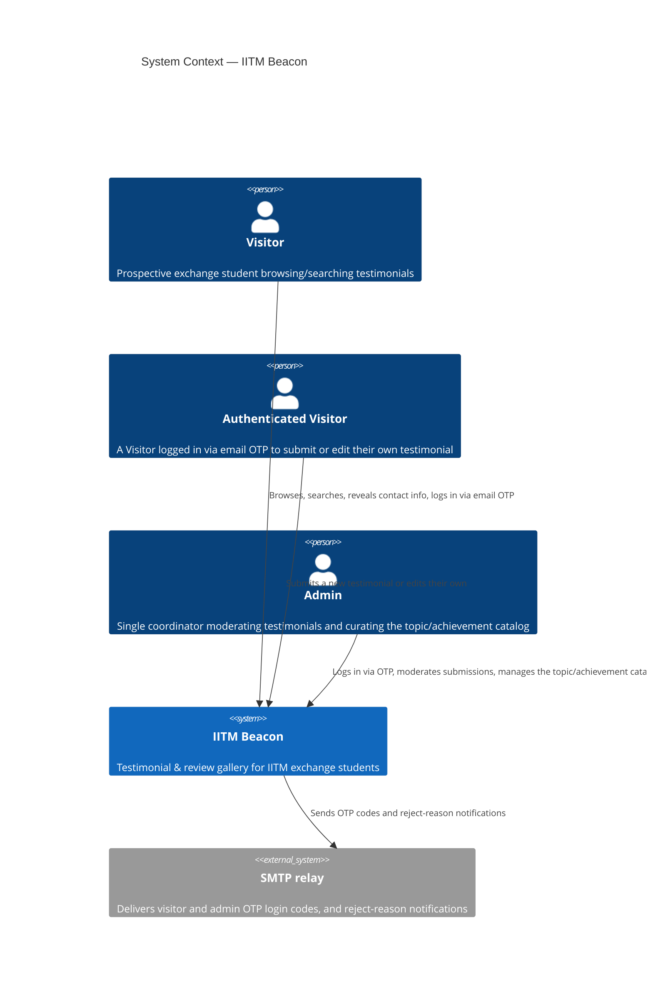
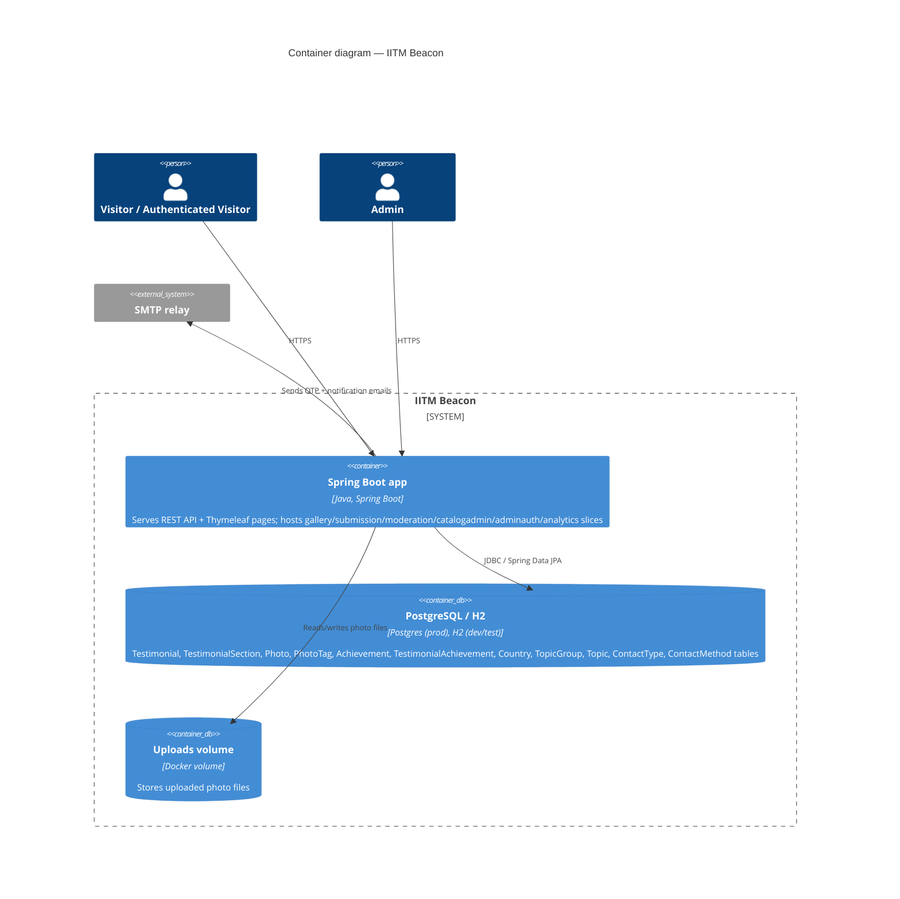
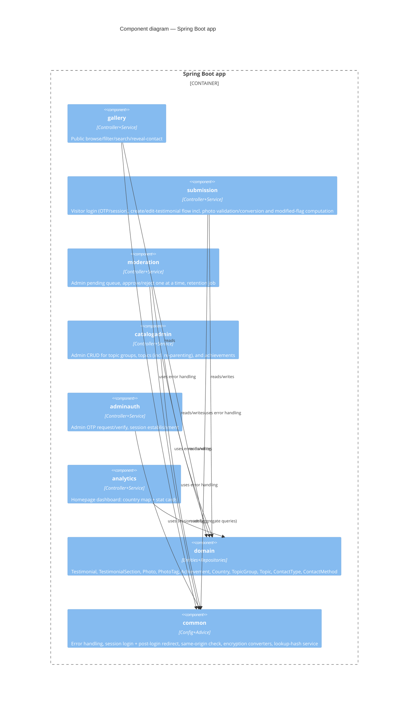
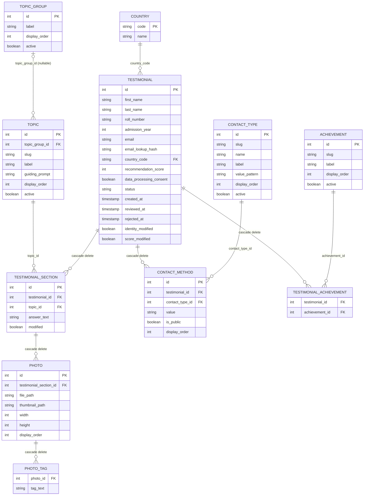

# Architecture

> **Locked — approved baseline (2026-09-10).** Reviewed for consistency across `scope.md`,
> `nfr.md`, `use-cases.md`, `decisions.md`, and `api-spec.yaml`. AI agents: do not edit this
> file — wording, structure, or cross-references — without the user's explicit approval first.

This doc assumes the locked baseline — `scope.md`, `nfr.md`, and `use-cases.md`. `api-spec.yaml`
is kept in sync with it. All accepted decisions live in `decisions.md` and are referenced here
by number rather than restated.

## 1. Style

Layered (Controller → Service → Repository → DB), sliced vertically by feature rather than one
monolithic package per layer. A small shared `domain` layer holds the entities/repositories
that multiple slices need to read or write. No slice imports another slice's classes directly —
only `domain` and `common` (decision 9). This is what makes each slice independently
implementable, addable, or removable.

## 2. C4 diagrams

### 2.1 Context



A future integration with a separate sibling service is anticipated (decision 16) but is not
part of this system's current context, so it isn't modeled here.

### 2.2 Container



### 2.3 Component (inside the Spring Boot app)



## 3. Package / slice layout

```
com.iitm.beacon
├── common/            Cross-cutting: @RestControllerAdvice error handling, shared
│                      error-response DTO, base exceptions, the security layer's JSON 401/403
│                      writers (RestAuthenticationEntryPoint, RestAccessDeniedHandler — §15),
│                      EncryptedValueConverter (AES, decision 6, shared by Testimonial.email
│                      and ContactMethod.value), EmailLookupHashService (HMAC-SHA256,
│                      decision 6). common.security: SessionAuthenticator (session login after
│                      an OTP verify) and PostLoginRedirect (return to the requested page —
│                      decision 23). common.web: the same-origin check (SameOriginOnly,
│                      SameOriginInterceptor, SameOriginGuard, SameOriginProperties —
│                      decision 27).
├── config/            Spring Security config (SecurityConfig; separate admin and visitor
│                      principals/roles, page login redirects — decision 23), mail
│                      (JavaMailSender) config, @EnableScheduling setup, multipart/upload size
│                      config, env-driven @ConfigurationProperties (admin OTP ttl/max attempts,
│                      visitor OTP ttl/max-attempts/request-rate, photo limits and conversion
│                      settings via PhotoStorageProperties, cleanup cron, encryption key, HMAC
│                      pepper), WebMvcConfig (static `/uploads/**` resource handler — decision 2,
│                      §7; also registers SameOriginInterceptor). OtpMailer and
│                      NotificationMailer (each a Smtp*/Logging*, prod/non-prod profile pair —
│                      decision 21), PhotoUrlResolver (shared `/uploads/`-URL builder used by
│                      submission/gallery/moderation — decision 21).
├── domain/
│   ├── testimonial/   Testimonial, TestimonialSection, Photo, PhotoTag, ContactMethod
│   │                  entities, TestimonialStatus enum, their repositories.
│   ├── country/       Country entity (ISO 3166-1 alpha-2 key), CountryRepository.
│   ├── topic/         TopicGroup, Topic entities (Topic optionally FK'd to a TopicGroup —
│   │                  decision 11), their repositories.
│   ├── contacttype/   ContactType entity (seed-only reference data, decision 5),
│   │                  ContactTypeRepository.
│   └── achievement/   Achievement entity, TestimonialAchievement join entity, repositories.
├── gallery/           Public browse/filter/search/paginate + testimonial detail + photo list,
│                      as REST (`api-spec.yaml`) and as pages (decision 21); on-demand contact
│                      reveal only as a page route, `POST /gallery/{id}/contact` (decision 27).
│                      GalleryController, GalleryService, TestimonialSpecifications,
│                      TestimonialCardDto, TestimonialDetailDto; GalleryViewController.
├── submission/        Visitor login (email OTP request/verify/session — decision 17),
│                      create/edit-testimonial flow including file upload validation and the
│                      "updated since last approval" flag computation, including the
│                      moderation short-circuit for non-text edits (decision 18); the same flow
│                      as REST (`api-spec.yaml`) and as pages (decision 21).
│                      VisitorAuthController, VisitorOtpService (in-memory, concurrent-safe,
│                      keyed by email — decision 17; owns its own request-rate check, called by
│                      both controllers below), SubmissionController, SubmissionService
│                      (`create`/`edit` plus the form-only `createFromForm`/`editFromForm`
│                      adapters and `listAllCountries`/`listTopicCatalog` — decision 21),
│                      FormSubmission (package-private: form command → request translation and
│                      violation-path mapping back to form fields — decision 21),
│                      TestimonialSubmissionRequest (DTO), PhotoStorageService,
│                      PhotoImageProcessor (upload → WebP conversion), PhotoUploadLimits,
│                      LegacyPhotoBackfill (startup conversion of pre-WebP photos — decision
│                      22); SubmissionViewController.
├── moderation/        Admin pending queue, approve/reject one at a time — no bulk actions
│                      (decision 18) — as REST (`api-spec.yaml`) and as a page (decision 21); and
│                      the rejected-testimonial retention job (not yet built — M7).
│                      ModerationController, ModerationService, ModerationTestimonialDetailDto,
│                      ModerationQueueCardDto; ModerationViewController;
│                      RejectedTestimonialCleanupJob (@Scheduled, planned for M7).
├── catalogadmin/      Admin CRUD for topic groups, topics (incl. re-parenting), and
│                      achievements (decision 9). Not yet built.
│                      CatalogAdminController, CatalogAdminService, TopicGroupDto, TopicDto,
│                      AchievementDto.
├── adminauth/         Admin OTP request/verify, session establishment (decision 4), as REST
│                      (`api-spec.yaml`) and as a page (decision 21).
│                      AdminAuthController, OtpService (in-memory, single admin; owns its own
│                      request-rate check, called by both controllers below);
│                      AdminAuthViewController.
└── analytics/         Homepage dashboard: country map + achievement/score/topic-group stat
                       cards.
                       AnalyticsController, AnalyticsService (read-only aggregate queries).
```

Why `domain` is separate from the feature slices: entities are read and written across
multiple features (gallery reads approved rows, submission creates/edits them, moderation
transitions their status, catalogadmin curates the reference tables they point at, analytics
aggregates over them). Putting them in one place avoids duplicating JPA mappings per slice;
each feature slice still owns its own controller/service/DTOs.

Slice boundaries follow the bounded contexts `use-cases.md`'s own use-case diagram already
draws — its "Submission" subgraph groups visitor login with create/edit; its "CatalogAdmin"
subgraph is drawn separately from "Moderation" — rather than inventing new ones (decision 9).

## 4. Entity / DB schema



### Country
| column | type | notes |
|---|---|---|
| code | PK, varchar(2) | ISO 3166-1 alpha-2, e.g. `IN`, `US` |
| name | varchar, not null | canonical English short name |

Seeded once, in full, via migration (decision 1) — not grown from submissions.

### TopicGroup
| column | type | notes |
|---|---|---|
| id | PK | |
| label | varchar, not null | shown as the group heading on the form and in the article view |
| display_order | int, not null | ordering among top-level picks |
| active | boolean, not null, default true | hides the group (and, by extension, its topics) from new picks without breaking FK history |

Database-driven reference data, managed via the `catalogadmin` catalog screen (decision 9) —
no code change or redeploy required to add/rename/reorder/deactivate one.

### Topic
| column | type | notes |
|---|---|---|
| id | PK | |
| topic_group_id | FK -> TopicGroup, nullable | `null` = standalone topic (decision 11) |
| slug | varchar, unique, not null | e.g. `academics_teaching` |
| label | varchar, not null | shown as the section subheading |
| guiding_prompt | text, not null | shown as placeholder/help text on the form |
| display_order | int, not null | ordering on the form and in the article view |
| active | boolean, not null, default true | hides from the form without breaking FK history |

Database-driven reference data (decision 11), managed via `catalogadmin`, including
re-parenting (moving a topic between groups, or promoting it to standalone).

### ContactType
| column | type | notes |
|---|---|---|
| id | PK | |
| slug | varchar, unique, not null | e.g. `email`, `whatsapp`, `telegram`, `instagram`, `twitter` |
| name | varchar, not null | display name shown next to each contact row on the form, e.g. `WhatsApp`, `X (Twitter)` |
| label | varchar, not null | placeholder/help text shown inside the form's input |
| value_pattern | varchar, nullable | regex (no `^`/`$`) a trimmed contact value must fully match; also rendered as the input's HTML `pattern`, so valid in both Java and browser `v`-flag syntax; null = only non-blank is required (decision 5) |
| display_order | int, not null | |
| active | boolean, not null, default true | |

Seed-only reference data (decision 5) — seeded once via migration; no admin-catalog UI
manages this table (no use case calls for one), so a new contact type is a direct database
edit, same treatment as `Country`.

### Achievement
| column | type | notes |
|---|---|---|
| id | PK | |
| slug | varchar, unique, not null | |
| label | varchar, not null | checkbox label |
| display_order | int, not null | |
| active | boolean, not null, default true | |

Same configurability pattern as `Topic` (decision 11), managed via `catalogadmin`.

### Testimonial
| column | type | notes |
|---|---|---|
| id | PK | |
| first_name | varchar, not null | plain text, admin-only in full (decision 10) |
| last_name | varchar, not null | plain text, admin-only in full (decision 10) |
| roll_number | varchar, not null | plain text, admin-only (decision 10) |
| admission_year | int, not null | plain text, admin-only (decision 10) |
| email | varchar, not null | encrypted at rest via `EncryptedValueConverter` (decision 6); sourced from the visitor's login, never typed on the form |
| email_lookup_hash | varchar, unique, not null | deterministic HMAC-SHA256 of the normalized email (decision 6); used only for equality lookups |
| country_code | FK -> Country, not null | |
| recommendation_score | int, not null, 0-10 | one per testimonial (decision 15) |
| data_processing_consent | boolean, not null | must be true to persist the row (decision 7) |
| status | enum: PENDING / APPROVED / REJECTED, not null, default PENDING | |
| created_at | timestamp, not null | |
| reviewed_at | timestamp, nullable | set on approve or reject by an admin — never touched by the moderation short-circuit (decision 18) |
| rejected_at | timestamp, nullable | drives the 30-day cleanup job (decision 3) |
| identity_modified | boolean, not null, default false | set when any identity field changes since the last approval; always blocks the moderation short-circuit (decision 18) |
| score_modified | boolean, not null, default false | set when `recommendation_score` changes; never blocks the moderation short-circuit by itself — kept only so an admin reviewing the testimonial for another reason can see the score also changed (decision 18) |

Identity is captured as `first_name`/`last_name`/`roll_number`/`admission_year` (decision 10),
not a single combined name field. No `contact_info`/`share_contact_publicly` columns — that's
modeled via `ContactMethod` instead (decision 5). No `text` column — content lives in
`TestimonialSection`. No `User`/admin table: the single admin's email is config (`ADMIN_EMAIL`),
not a DB row (decision 4). No `country_modified`, `achievements_modified`, or
`contacts_modified` columns — changes to `country_code`, `TestimonialAchievement` rows, or any
`ContactMethod` are never tracked, since none of them ever gates moderation (decision 18).

### TestimonialSection
| column | type | notes |
|---|---|---|
| id | PK | |
| testimonial_id | FK -> Testimonial, not null, on-delete cascade | |
| topic_id | FK -> Topic, not null | |
| answer_text | text, not null | |
| modified | boolean, not null, default false | set when an edit changes this section's text *or its photos* (or adds the section); only meaningful — and only ever read — once the testimonial has been approved at least once (before that, its value doesn't affect anything); drives the public "updated" badge and always blocks the moderation short-circuit (decision 18) |

At least one section required per testimonial (decision 12).

### Photo
| column | type | notes |
|---|---|---|
| id | PK | |
| testimonial_section_id | FK -> TestimonialSection, not null, on-delete cascade | (decision 2) |
| file_path | varchar, not null | the full-size WebP (`<uuid>.webp`), relative path within the mounted uploads volume; for a legacy photo not yet converted, its original upload |
| thumbnail_path | varchar, nullable | the thumbnail WebP (`<uuid>-thumb.webp`), relative like `file_path`; null for a legacy photo stored before thumbnails (decision 22) |
| width | int, nullable | full-size image width in pixels; null for a legacy photo |
| height | int, nullable | full-size image height in pixels; null for a legacy photo |
| display_order | int, not null | ordering within its section, and across the article view |

Count per testimonial and per section, and max file size, are enforced in `SubmissionService`/
`PhotoStorageService`, driven by env vars (decisions 2, 22) — not DB constraints. The three
nullable columns come from migration `V18`; `LegacyPhotoBackfill` fills them for older rows
(§7).

### PhotoTag
| column | type | notes |
|---|---|---|
| photo_id | FK -> Photo, not null, on-delete cascade | |
| tag_text | varchar, not null | free-form, submitter-entered |

Up to 10 rows per `photo_id`, enforced server-side (decision 2).

### TestimonialAchievement
| column | type | notes |
|---|---|---|
| testimonial_id | FK -> Testimonial, not null, on-delete cascade | |
| achievement_id | FK -> Achievement, not null | |

Composite PK (`testimonial_id`, `achievement_id`).

### ContactMethod
| column | type | notes |
|---|---|---|
| id | PK | |
| testimonial_id | FK -> Testimonial, not null, on-delete cascade | |
| contact_type_id | FK -> ContactType, not null | |
| value | varchar, not null | encrypted at rest via the same `EncryptedValueConverter` as `Testimonial.email` (decision 6) |
| is_public | boolean, not null, default false | set per entry by the submitter (decision 5) |
| display_order | int, not null | |

A submitter may add 0–N entries. Replaces the old single `contact_info` +
`share_contact_publicly` pair (decision 5).

## 5. Admin OTP login flow (decision 4)

Behavior is specified as UC-ADMIN-OTP-REQUEST/UC-ADMIN-OTP-VERIFY in `use-cases.md`; exact
request/response shapes are in `api-spec.yaml`. `OtpService` holds
`{ code, expiresAt, attemptsRemaining }` for the single admin email in
memory — no DB table. TTL and max attempts are `@ConfigurationProperties`, backed by env vars.
No concurrent-session cap. An app restart drops any in-flight OTP request; the admin simply
requests a new one. After a successful verify on the login page, the admin lands on the
moderation page they were sent to the login from (an expired session), otherwise on
`/moderation/queue` (decision 23, §6).

## 6. Visitor authentication & session (decision 17)

Behavior is specified as UC-VISITOR-LOGIN in `use-cases.md`.

- `VisitorOtpService` holds OTP state in a concurrent-safe, in-memory store (e.g. a Caffeine
  cache) keyed by the normalized plaintext email, entry shape `{ codeHash, expiresAt,
  attemptsRemaining }`, TTL matched to the OTP's own validity window — never persisted. This is
  the visitor-scale analogue of `OtpService` (section 5): same OTP style, but keyed and
  concurrent-safe since many visitors can hold a live OTP at once, instead of one mutable
  field.
- The OTP *request* endpoint is separately rate-limited per email and per IP (also in-memory,
  e.g. via Bucket4j), and its response is identical whether or not the email has an existing
  testimonial — no enumeration (NFR-VISITOR-OTP-BRUTEFORCE).
- On successful verify, Spring Security establishes a session under a visitor-scoped principal
  (a distinct role from the admin's), and `SubmissionService` calls
  `TestimonialRepository.findByEmailLookupHash(...)` (decision 6) to route to
  UC-CREATE-TESTIMONIAL (nothing found) or UC-EDIT-TESTIMONIAL (found) regardless of that
  testimonial's status.
- TTL, max attempts, and request rate are `@ConfigurationProperties`, backed by env vars,
  configured independently from the admin's own OTP settings.
- An app restart drops any in-flight visitor OTP requests — the visitor simply requests a new
  one; an accepted trade-off given the mechanism stays entirely in-process (decision 17).
- Sessions (both roles, decision 23): one HTTP session per browser, idle timeout 24 hours
  (`server.servlet.session.timeout`, `BEACON_SESSION_TIMEOUT`). A request to a login-protected
  page without a live session is redirected to its role's login page — `/submissions/form` and
  `/submissions/confirmation` to `/submissions/login`, `/moderation/**` to `/admin/login` —
  while the JSON API keeps answering 401. A GET of such a page is saved in the session first
  (`HttpSessionRequestCache`, restricted to exactly those GETs), and the login's verify handler
  sends the user back to it through `common.security.PostLoginRedirect`, which only ever returns
  a GET's path and query under the role's own pages, else the role's default page
  (`/submissions/form`, `/moderation/queue`). A form POST isn't saved, so a submission sent after
  the session expired lands on the form, its input lost.
- Session ping: `GET /api/submissions/session` (visitor) and `GET /api/moderation/session`
  (admin) answer 204 while the session lives — the request itself extends it — and JSON 401/403
  otherwise. `static/js/session-check.js` calls its role's ping when a protected page's tab
  becomes visible again and reloads the page on 401/403, which then goes through the login
  redirect and back (§17).

## 7. Photo storage and ownership (decision 2)

- Photos are written to a filesystem directory mounted as a Docker volume (e.g.
  `/data/uploads`), separate from the app container's own filesystem.
- `Photo.file_path` and `Photo.thumbnail_path` store paths relative to that root.
- Each `Photo` belongs to a `TestimonialSection`, inheriting that section's topic as its
  automatic tag, plus up to 10 free-form `PhotoTag` entries.
- Limits, all server-side and env-configured (`beacon.storage.*`, `config/PhotoStorageProperties`;
  defaults in decision 22): photos per section (5) and per testimonial (50), kept and new photos
  counted together, checked by `SubmissionService` before any file is converted or stored; size
  per uploaded file (20 MB), checked by `PhotoStorageService` before the file is read; pixels per
  image (250 MP), checked by `PhotoImageProcessor` from the file header before decoding.
- Conversion (`submission.PhotoImageProcessor`, decision 22): the format is detected from the
  actual bytes by the registered `ImageIO` readers (JDK + TwelveMonkeys plugins: JPEG incl.
  CMYK, PNG, GIF, BMP, TIFF, WebP, PSD, PNM, TGA), never from the client-declared `Content-Type`
  or filename extension (NFR-UPLOAD-SPOOFING); a file nothing can decode — HEIC/HEIF and AVIF
  included — is rejected as an unsupported format. The largest decodable image in the file is
  decoded with source subsampling, converted to 8-bit sRGB from its embedded colour profile,
  EXIF-oriented, and downscaled (never upscaled) to a full-size image of at most 2560 px and a
  thumbnail of at most 640 px on the long edge, both encoded as lossy WebP (quality 82/75) by
  `webp-imageio`'s bundled native libwebp. No metadata of the original (EXIF incl. GPS, XMP, ICC)
  is copied, and the uploaded file itself is never kept.
- Files: `PhotoStorageService.store` writes `<uuid>.webp` and `<uuid>-thumb.webp` (never
  overwriting; if the thumbnail can't be written the full-size file is removed again) and returns
  their paths plus the full-size pixel size for the `Photo` row. `delete(Photo)` removes both
  files, best-effort. The random UUID keeps paths under the public `/uploads/**` prefix
  unguessable from a testimonial or photo id.
- Legacy photos (stored before the pipeline: original file, no thumbnail, no size) are converted
  by `submission.LegacyPhotoBackfill` once, synchronously at startup
  (`beacon.storage.backfill.enabled`, on by default; off in the test configuration): id-ordered
  batches of 50; per photo, convert and write the new files, then in its own transaction re-point
  the row only if it is unchanged (`PhotoRepository.replaceLegacyFile`), and delete the original
  only after that commit. A failure is logged as a WARN and leaves row and file untouched, to be
  retried on the next start; each pass logs a summary. Until then a legacy photo is served with
  its original file as its own thumbnail and no size.
- Startup check: constructing `PhotoImageProcessor` encodes a 1×1 WebP, so the app refuses to
  start where the native encoder can't load (§13), instead of failing the first upload.
- Files are served back to any client through a plain Spring static resource handler
  (`config/WebMvcConfig`, a `WebMvcConfigurer` mapping `/uploads/**` to the mounted directory) —
  not a dedicated per-photo endpoint, and not owned by any one feature slice, matching the rest
  of `config`'s cross-cutting role (§3). `.webp` files are served as `image/webp`.
- Page and API use: `gallery.PhotoRefDto`/`moderation.ModerationPhotoRefDto` carry `url` (full
  size), `thumbnailUrl` (the full-size URL again for a legacy photo) and `width`/`height` (null
  for a legacy photo); gallery cards, article thumbnails and the moderation queue show the
  thumbnail, and the fullscreen viewer loads the full size (decision 24).
- Known risk (open question, no decision yet): conversion runs synchronously inside the
  submission request and its transaction, on one thread — measured at about 1.2–1.9 s per 12 MP
  photo, so a submission with the maximum 50 photos spends roughly 60–100 s converting before it
  answers. A reverse proxy with a shorter request timeout would cut such a request off.
  Parallel conversion and proxy timeouts still need to be decided.

## 8. Contact & email encryption, lookup, and reveal (decisions 5, 6)

- `Testimonial.email` and every `ContactMethod.value` are encrypted at the application level
  via a shared `EncryptedValueConverter` (JPA `AttributeConverter`, AES, key from an env var) —
  the only fields treated this way.
- `Testimonial.email` additionally carries `email_lookup_hash` (HMAC-SHA256 with a server-side
  pepper env var — decision 6): a deterministic value used only to answer "does a testimonial
  already exist for this email" (UC-VISITOR-LOGIN). It never round-trips back to plaintext —
  it only proves equality. No other field gets a lookup hash: contact-method values are never
  searched by equality, only decrypted for direct display.
- The gallery's normal list/detail responses never include any `ContactMethod` value or the
  email. They are only decrypted and returned by the article page's reveal-contact route
  (UC-REVEAL-CONTACT, decision 27), `POST /gallery/{id}/contact`, gated on the testimonial being
  `APPROVED`, returning only the entries with `is_public = true` (type + value), rendered as an
  HTML card. There is no JSON endpoint for contact values. The route only answers requests
  from this site's own pages (`@SameOriginOnly`: `Origin` must be this site's, `Sec-Fetch-Site`
  if sent must be `same-origin`, else 403) — a header check that stops other websites and naive
  scraping, knowingly bypassable by a client that forges the headers.
- Moderation responses do include decrypted contact-method values and the email, since the
  admin needs them to decide (UC-VIEW-PENDING-QUEUE).
- All other fields — including `first_name`, `last_name`, `roll_number`, `admission_year` —
  stay unencrypted, so free-text search (decision 8) keeps working as a plain indexed query.

## 9. Moderation workflow: one-at-a-time review and the "updated since approval" short-circuit (decision 18)

- Moderation is approve/reject one testimonial at a time — there is no bulk-approve/bulk-reject
  action.
- `TestimonialSection.modified`, `Testimonial.identity_modified`, and `Testimonial.score_modified`
  are computed by `SubmissionService` inside the same transaction as an edit-save: each incoming
  value is compared against what's currently stored, and the flag is set `true` if it actually
  changed. A brand-new section added on an edit, or any photo added/removed/replaced within a
  section, also counts as that section being modified. Changes to `country_code`,
  `TestimonialAchievement` rows, or any `ContactMethod` are not tracked at all — there's nothing
  to compute for them.
- **Short-circuit:** if the testimonial's status was already `APPROVED` before this edit, and
  neither `TestimonialSection.modified` (on any section) nor `identity_modified` is set, the
  testimonial stays `APPROVED` — it never goes to `PENDING`, regardless of what else changed
  (score, country, achievements, contacts). `SubmissionService` clears `score_modified` itself,
  immediately, in this case, since nothing entered the queue and nothing needs to stay flagged;
  `reviewed_at` is left untouched, since no human reviewed this change.
- Any other edit — one that touches section text, photos, or identity fields, or one made to a
  testimonial that was `PENDING` or `REJECTED` before the edit — always sets status to
  `PENDING` for full re-moderation, regardless of which fields changed.
- Public exposure stays narrow: only `TestimonialSection.modified` reaches the public detail
  view, rendered as an "updated" badge on the affected subtopic/standalone topic
  (UC-EXPAND-TESTIMONIAL). `identity_modified` and `score_modified` are admin-only, shown in the
  moderation queue (UC-VIEW-PENDING-QUEUE) for whatever *does* still reach it — `score_modified`
  purely as context, since it never causes the item to be there by itself.
- `ModerationService` clears every flag back to `false` as part of a normal approve
  (UC-APPROVE-TESTIMONIAL).
- On reject (UC-REJECT-TESTIMONIAL), `ModerationService` always emails the submitter via the
  existing SMTP relay (same one used for OTP codes) to let them know to log in and fix their
  testimonial, including the admin's reason text in the email when one was given.

## 10. Catalog admin (decision 9)

- `catalogadmin` is a dedicated slice, separate from `moderation`, covering
  UC-MANAGE-TOPIC-GROUPS, UC-MANAGE-TOPICS, and UC-MANAGE-ACHIEVEMENTS.
- `TopicGroup`, `Topic`, and `Achievement` all support create / rename / reorder / deactivate;
  `Topic` additionally supports re-parenting — changing its `topic_group_id`, including to/from
  `null` (standalone).
- Deactivation is always non-destructive: an inactive row stops being offered as a new pick
  (submission form, gallery filter, dashboard), but any `TestimonialSection` or
  `TestimonialAchievement` row already referencing it is unaffected and keeps rendering
  (NFR-CATALOG-CONFIGURABILITY).
- No caching layer sits in front of these tables — they're read per request, so a catalog
  change takes effect immediately, with no redeploy (NFR-CATALOG-CONFIGURABILITY).
- `ContactType` (decision 5) is deliberately **not** managed here — no use case calls for an
  admin UI over it, so it stays seed-and-edit-directly, like `Country`.

## 11. Rejected-testimonial retention job (decision 3)

Behavior is specified as UC-PURGE-REJECTED in `use-cases.md` — system-initiated, no HTTP
endpoint, so it has no `api-spec.yaml` entry.

- `RejectedTestimonialCleanupJob`, `@Scheduled` weekly.
- Finds `Testimonial` rows with `status = REJECTED` and `rejected_at` older than 30 days,
  deletes their photo files, then deletes the testimonial row (cascading through sections,
  photos, and contact methods).
- Inject a `Clock` bean (rather than calling `Instant.now()` directly) so the 30-day window is
  testable without real time passing.

## 12. Search & filtering (decision 8)

- Country filter, free-text search, and the topic filter combine as AND conditions. The topic
  filter now operates on top-level picks — groups and standalone topics (decision 11):
  selecting a group expands to its member `topic_id`s, conceptually:
  `WHERE status = APPROVED [AND country_code = :country] [AND EXISTS (section WHERE topic_id
  IN :topicIds)] [AND (section.answer_text ILIKE %:q% OR first_name ILIKE %:q% OR last_name
  ILIKE %:q%)]`
- Implemented via a Spring Data JPA query method or `Specification`, paginated
  (`Pageable`/`Page<T>`).
- Indexes: `(status, country_code)` on `Testimonial`, and `topic_id` on `TestimonialSection`
  (supports the topic filter), per NFR-SEARCH-PERFORMANCE.

## 13. Deployment

- `Dockerfile`: multi-stage — Maven build stage, slim JRE runtime stage
  (`eclipse-temurin:21-jre-jammy`, a glibc Linux image). The photo pipeline's WebP encoder is a
  native library: `webp-imageio` bundles libwebp builds (glibc-linked for Linux) inside its jar and
  extracts the one for the current platform into the JVM temp directory (`java.io.tmpdir`, i.e.
  `/tmp`) on first use. The runtime container must therefore keep `/tmp` writable (and not mounted
  `noexec`) and stay on a glibc base image (not Alpine/musl); otherwise the app refuses to start
  (§7).
- `docker-compose.yml`: app + Postgres, a named volume for `/data/uploads`, a named volume for
  Postgres data. Two tooling services under the `tools` profile: `maven` (static analysis,
  `make` targets — decision 19) and `e2e` (browser end-to-end tests, built from
  `Dockerfile.e2e`: the `mcr.microsoft.com/playwright/java` image, tag equal to
  `playwright.version` in `pom.xml`, plus the project's Temurin 21 JDK; run by `make e2e` /
  `make e2e-update-screenshots` — decision 25).
- Behind a reverse proxy (TLS termination, another host name or port), set
  `BEACON_ALLOWED_ORIGINS` to the public origin(s) browsers use, or the contact reveal's
  same-origin check refuses every request (decision 27). `server.forward-headers-strategy` is
  deliberately left off: Tomcat would trust `X-Forwarded-*` from the Docker network's private
  addresses, which would let a client spoof its IP for the per-IP OTP request limits.
- Known risk: a submission with many photos takes a long time to convert synchronously (§7);
  a proxy in front of the app needs a request timeout long enough for it, until that open
  question is decided.
- `application.yml` profiles:
  - `dev`: H2, OTP logged (not emailed) for both admin and visitor login, relaxed local config.
  - `prod`: Postgres, real SMTP, Flyway migrations (no `ddl-auto=update` in prod, per baseline
    rules).
- Secrets/config via environment variables only (`ADMIN_EMAIL`, SMTP credentials, DB
  credentials, `admin.otp.*`, `visitor.otp.*` (ttl, max attempts, request rate per email/IP),
  session timeout, photo count/size/pixel limits and conversion settings, multipart limits,
  allowed origins, cleanup cron, encryption key, HMAC pepper) — never committed.
  `.env.example` documents the required ones and the photo/session/origin overrides; the compose
  `app` service currently forwards only the required ones plus `BEACON_ALLOWED_ORIGINS`
  (BL-023).
- Hosting target: free-tier by default; university-server hosting is a viable alternative (see
  `scope.md` Constraints).

## 14. Future integration (decision 16)

A future merge with a separate, independently-developed sibling service (same tech stack) is
anticipated, targeting a single unified Spring Boot application. Consequence for this codebase:
`adminauth` and `common` are kept self-contained and free of gallery-specific assumptions, so
they can be reused as-is after that merge. No shared database tables are planned between the
two services.

## 15. Error handling

- `common.error.GlobalExceptionHandler` (`@RestControllerAdvice`) maps exceptions raised by
  controllers to one consistent error-response DTO: validation failures → 400, a wrong OTP →
  401, not-found → 404, a conflicting state → 409, an oversized multipart request → 413 (any
  other multipart failure → 400), too many OTP requests → 429, anything else → 500 with a
  generic message. No stack traces or internal messages reach the client
  (NFR-ERROR-TRANSPARENCY).
- Authentication and authorization failures never reach a controller, so the advice doesn't
  handle them: the Spring Security filter chain does. `common.error.RestAuthenticationEntryPoint`
  writes the same JSON shape with 401 for an unauthenticated request, and
  `common.error.RestAccessDeniedHandler` with 403 for a session of the wrong role — except that
  an unauthenticated request to a login-protected page is redirected to its login page instead
  (decision 23, §6). A logged-in user of the other role still gets the JSON 403 on a page
  (BL-033).
- `common.web.SameOriginInterceptor` refuses a request to a `@SameOriginOnly` handler that
  doesn't come from this site's own pages with a 403 and a one-line plain-text reason, before the
  handler runs (decision 27).
- Page (View-Controller) errors are handled in the View-Controller itself — redirect, re-render
  with an inline error, or an in-slice not-found page — never as JSON (§17).

## 16. Testing notes

Full methodology lives in the `tdd-enforcer` subagent. Browser end-to-end tests (Playwright,
`com.iitm.beacon.e2e`, run in Docker via `make e2e`) are the one level written after the
implementation rather than test-first — see `test_plan.md` §1. A few things worth flagging at the
architecture level because they're time-based or easy to get subtly wrong without a seam:
- OTP expiry/attempts logic, for **both** `OtpService` (admin) and `VisitorOtpService`
  (visitor) — inject a `Clock`.
- Rejected-testimonial retention job — inject the same `Clock`, so 30-day-old fixtures don't
  require actually waiting 30 days.
- "Updated since last approval" flag set/clear logic, **including the moderation
  short-circuit** (decision 18) — not time-based, but has several distinct paths (edit-save
  that stays pending, edit-save that short-circuits, normal approve) that are easy to get
  subtly wrong; worth testing each explicitly, especially that the short-circuit never fires
  for a testimonial that wasn't already `APPROVED`, and that a flag left set (or wrongly
  cleared) is easy to miss by inspection alone.
- The legacy photo backfill (§7) is switched off in the test configuration
  (`beacon.storage.backfill.enabled: false`) so it never runs as a side effect of a context
  start; its tests invoke it explicitly. Every full application context (`@SpringBootTest`)
  still constructs `PhotoImageProcessor`, whose WebP encoder check needs the native libwebp to
  load wherever the suite runs.

## 17. View layer: Thymeleaf pages alongside the REST API (decision 21)

`gallery`, `submission`, `moderation`, and `adminauth` each expose their functionality twice:
once as the JSON REST API `api-spec.yaml` already specifies, and once as server-rendered HTML
pages. Both are built on the same `Service` class per slice — the page-rendering
`XxxViewController` (`@Controller`) calls the exact same `GalleryService`/`SubmissionService`/
`ModerationService`/`OtpService` methods the REST `XxxController` (`@RestController`) does, as a
plain in-process Java call. Neither controller depends on the other, and the REST contract is
unchanged. `catalogadmin` and `analytics` have no page yet, since neither slice is built yet.

**Routing.** View routes are plain paths, not `/api/**`:

| Route | Slice | Access |
|---|---|---|
| `GET`/`HEAD` `/` (redirect to `/gallery`), `/gallery`, `/gallery/{id}` | gallery | public |
| `POST /gallery/{id}/contact` (contact reveal — decision 27) | gallery | public, same-origin requests only |
| `/submissions/login`, `/submissions/login/**` | submission | public |
| `/submissions/form`, `/submissions/confirmation` | submission | `VISITOR` session; without one → redirect to `/submissions/login` |
| `/admin/login` (email step), `/admin/login/code` (code step), `/admin/login/**` | adminauth | public |
| `/moderation/**` | moderation | `ADMIN` session; without one → redirect to `/admin/login` |

`SecurityConfig` enumerates every one of these (and every `/api/**` route) as its own explicit
matcher; the catch-all tail is `.anyRequest().denyAll()`, not `.authenticated()` — a route this
list doesn't name is refused outright, not merely gated behind "some role or other." The gallery
matchers are method-specific: `GET`/`HEAD` for its pages, `POST` only for the contact reveal. A
login-protected page answers a missing or expired session with a redirect to its login page and,
after the login, a return to the page (decision 23, §6); a session of the other role still gets
the JSON 403 (BL-033).

**Templates and shared chrome.** `src/main/resources/templates/<slice>/*.html`, one subdirectory
per slice. Shared chrome is factored into `templates/layout/` fragments:
- `shell.html` — `head(title)` for the `<head>`: viewport meta, stylesheet, and
  `static/js/nav-toggle.js` (deferred) on every page;
- `header-visitor.html` and `header-admin.html` — each a `header(activePage)` fragment for the
  two nav-bar variants; both put their nav (`#visitor-nav`, `#admin-nav`) behind the burger
  button below. The admin header also includes the session check, so every page using it gets
  it; the two admin login pages use their own inline header and never do;
- `nav-toggle.html :: toggle(navId)` — the reusable burger button (decision 26), driven by
  `static/js/nav-toggle.js` through `data-nav-toggle`/`aria-controls`/`aria-expanded`; to reuse
  it, give a nav an id and put the fragment right before it. Without JavaScript the button stays
  hidden and the nav stays visible;
- `session-check.html :: script(pingUrl)` — the session check (decision 23,
  `static/js/session-check.js`) for a page that needs a login. **Rule:** every login-protected
  visitor page must include it itself, with
  `layout/session-check :: script('/api/submissions/session')`
  (today `submission/form.html` and `submission/confirmation.html`), because
  `header-visitor.html` is shared with the public and login pages, which must never load it;
  admin pages get it from `header-admin.html`;
- `photo-viewer.html` — `photo(photo, caption, thumbClass)`, one photo as a `<figure>` (a link
  to the full-size image with `data-pswp-width`/`-height` and `data-caption`, the lazy-loaded
  thumbnail inside it, then the photo's tag chips), and `assets`, PhotoSwipe's stylesheet plus
  the `static/js/photo-viewer.js` module, included once at the end of a page that renders
  photos (decision 24).

One global stylesheet, `static/css/beacon.css`, holds every design token (colors, spacing,
radius, shadow, the 0–10 recommendation-score gradient) and component class, grown by each page
that needs new ones rather than pre-built up front. Pages are a full-height column on the beige
page background (`body` fills the screen, so a short page shows no white band below it), with
phone layouts from media queries at ≤720px and ≤480px and the gallery grid's own steps
(decision 26); on phones the topic chips (gallery filter and submission-form picker) are 32px
high with an invisible 40px tap area. Static assets are served under `/css/**`, `/js/**`,
`/images/**`, plus WebJar assets under `/webjars/**` (Alpine.js — decision 21; PhotoSwipe —
decision 24), all `permitAll`, through Spring Boot's default static-resource handling (not
`WebMvcConfig`'s `/uploads/**` mapping, which is unrelated). `shell.html`'s `head` declares an
empty inline favicon (`<link rel="icon" href="data:,">`) so browsers never probe `/favicon.ico`,
which the `denyAll()` tail would refuse; it's replaced by a real icon once a logo asset exists.

**No SPA.** Pages are ordinary server-rendered HTML: filtering/pagination/navigation are plain
`<a>`/`<form method="get">` links that reload the page with query parameters; state-changing
actions (submit, approve, reject, reveal-contact) are plain `<form method="post">`s, never an
XHR/`fetch` call against the slice's own REST API. Two small vanilla scripts add background
requests on top: `static/js/contact-reveal.js` sends the reveal-contact form itself with
`X-Requested-With: fetch` and swaps the returned HTML card in place (without the script the same
form posts normally and gets the whole article back — decision 27), and
`static/js/session-check.js` pings its role's session endpoint when a protected page's tab
becomes visible again (decision 23). In-page interactivity uses Alpine.js (decision 21), served
from the `org.webjars.npm:alpinejs` WebJar at the version-less
`/webjars/alpinejs/dist/cdn.min.js` (via `webjars-locator-lite`) and included only by the pages
that need it. Templates use the long attribute forms
(`x-bind:`/`x-on:`) rather than the `:`/`@` shorthands, and pass server-side values in through
`th:attr`/`th:data-*`; a component bigger than a few attributes is registered with
`Alpine.data(...)` in a page-specific script (`static/js/submission-form.js` for the submission
form), loaded with `defer` before Alpine itself. `[x-cloak]` is hidden in `beacon.css`, and a
page that relies on it adds a `<noscript>` override so it degrades to showing everything.
The fullscreen photo viewer (decision 24) is PhotoSwipe 5 from the `org.webjars.npm:photoswipe`
WebJar, driven by the ES module `static/js/photo-viewer.js` (loaded with `type="module"`;
PhotoSwipe's core is imported only on first open). It reads the already server-rendered
`photo-viewer.html :: photo` figures — no separate endpoint: every element marked
`data-photo-gallery` is one gallery (the whole article on `gallery/detail.html`, each
`.moderation-queue-item` on `moderation/queue.html`), its `a[data-photo-viewer-item]` links in
page order are the slides, and each figure's tag chips feed the caption bar (caption, tags,
"i / n" counter). The prev/next arrows are pinned by CSS (`.pswp.beacon-pswp` in `beacon.css`) to
the bottom corners, level with the caption, and a `paddingFn` keeps the photo clear of the close
button and the caption bar. A photo without a stored size (legacy) takes it from its
thumbnail's natural size, or from the full image once loaded.

**Error handling.** A `Service` call from a View-Controller can throw the exact same exceptions
it throws for its REST caller (`NotFoundException`, `TestimonialNotPendingException`,
`SubmissionValidationException`, `TooManyRequestsException`, an OTP-verification failure). Left
alone, `GlobalExceptionHandler`'s `@RestControllerAdvice` (which applies to every controller, not
only `@RestController`s) would turn one of these into a JSON error body for what's supposed to be
a page load or a form-POST redirect. Each `XxxViewController` therefore catches these locally and
responds the way a browser navigation needs: redirect back to the same page (approve/reject on a
now-stale item, per decision 18's own note that the admin's queue can go stale under concurrent
review), re-render the current form with an inline error (a wrong OTP code, a rate-limited
request, a failed validation), or render a small in-slice not-found page (an unknown or
not-yet/no-longer-approved testimonial id — the gallery detail page's 404 is deliberately
identical for "doesn't exist" and "exists but isn't approved," the same privacy property the REST
`GET /gallery/testimonials/{id}` already has; the contact reveal likewise answers 404 with an
"unavailable" card for an unknown, unapproved or contact-less testimonial).
`GlobalExceptionHandler` never branches on the caller being a page and still owns every actual
REST response.

**Submission form.** The REST `POST /api/submissions` contract takes one multipart `payload` part
(a JSON `TestimonialSubmissionRequest`) plus photo files keyed by `fileRef` — not something a
plain HTML `<form>` produces. Rather than change that shipped contract, `submission/form.html`
posts flat, `@ModelAttribute`-bound multipart fields, and `SubmissionService.createFromForm`/
`editFromForm` translate that command object into the same `TestimonialSubmissionRequest` +
file-map shape before calling the unmodified `create`/`edit`. The topic section is a picker
(decision 21): one toggle chip per top-level catalog entry (a group, keyed `group-{id}`, or a
standalone topic, keyed `topic-{id}`); each pick's subtopic blocks live in their own
`<fieldset>`, shown and enabled only while the pick is selected, so an un-picked topic's fields
are never posted. Every subtopic keeps its global `sections[i]` index regardless of which picks
are selected — the adapter already skips missing/empty indices. Initially picked: `general`,
plus any pick with a saved or re-submitted answer or photo. On submit, empty file inputs are
disabled to keep the multipart part count down. Contacts render one row per
active contact type, labelled with `ContactType.name`, using `ContactType.label` as the
input placeholder and `ContactType.valuePattern` as its HTML `pattern` (an unused row is simply
dropped by the adapter; its "public" checkbox stays disabled until the row has a value). The
country select starts on an empty "Select your country" placeholder and is `required`; the
server reports a blank country once, as "Please select your country.".

Photos: each topic block has one `<input type="file" multiple name="sections[i].photos">`, which
stays disabled until the block's textarea has text, and an Alpine `photoPicker` around it. The
picker shows the saved photos (edit mode: thumbnail, × to remove, tags field) followed by an
in-browser preview tile per new file, each with its own × and tags field
(`sections[i].photoTags[j]`, where `j` is the file's index in the input); it rebuilds the input's
`FileList` through a `DataTransfer` on every add or remove so that index pairing holds, accepts
drag & drop, and shows a "3 of 5" counter. It refuses, with an inline message, a non-image, a
file over the size limit, and anything beyond the per-topic or total photo limit. The limits
reach the page from `PhotoUploadLimits` — as data attributes for the script and as a
server-rendered line under every picker ("Up to 5 photos per topic, 50 in total, up to 20 MB
each. JPEG, PNG, WebP, GIF, TIFF or BMP."). Without JavaScript the native multiple input still
works (new photos then carry no tags) and each saved photo has a Remove checkbox.

Every one of these browser-side rules is also enforced by the server, and a rejected submission
re-renders the form with each message next to its own field (decision 21); the per-topic count
error sits at `sections[i].photos`. The recommendation-score
slider is a native `<input type="range">` bound to Alpine, showing the score's number and its
fixed label (docs/use-cases.md) in the score's gradient colour; it starts at 10 on a new
testimonial (decision 15). The 0–10 label list lives in `common` since both `gallery` and
`submission` render it (decision 9).

**Upload limits.** The business limits (decision 22) are `beacon.storage.*`: 5 photos per topic
(`BEACON_PHOTO_MAX_PER_SECTION`) and 50 per testimonial (`BEACON_PHOTO_MAX_COUNT`), kept and new
together, and 20 MB per photo file (`BEACON_PHOTO_MAX_SIZE_BYTES`). The servlet limits sit above
them: `application.yml` sets `server.tomcat.max-part-count`
(`BEACON_UPLOAD_MAX_PART_COUNT`, default 500 — above the form's no-JS worst case, where every
topic block is posted), `spring.servlet.multipart.max-file-size` (`BEACON_UPLOAD_MAX_FILE_SIZE`,
default 25MB per part — deliberately above the 20 MB business photo limit so
`PhotoStorageService` reports an oversized photo with its own message),
`spring.servlet.multipart.max-request-size` (`BEACON_UPLOAD_MAX_REQUEST_SIZE`, default 1010MB —
50 photos × 20 MB plus form text; raise it together with either photo limit), and
`spring.servlet.multipart.resolve-lazily: true`. With lazy resolution a limit violation surfaces
while the handler binds its arguments: `SubmissionViewController` catches `MultipartException`
locally and redirects back to the form with a flash error; for REST callers
`GlobalExceptionHandler` maps `MaxUploadSizeExceededException` to 413 and any other
`MultipartException` to 400.
