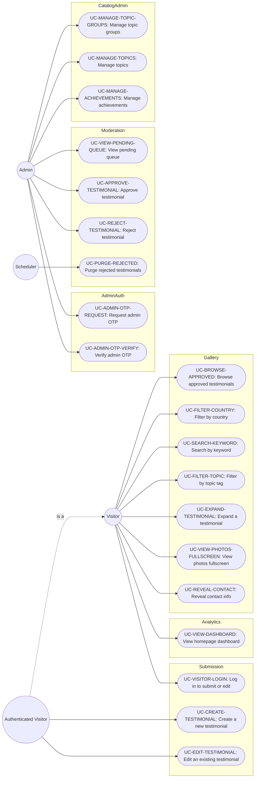

# Use Cases

> **Locked — approved baseline (2026-09-10).** Reviewed for consistency across `scope.md`,
> `use-cases.md`, and `nfr.md`. AI agents: do not edit this file — wording, structure, or
> cross-references — without the user's explicit approval first.

All functional requirements, expressed as use-case scenarios. See `scope.md` for the goals
these serve, `decisions.md` for the design decisions behind them, and `nfr.md` for the quality
attributes that constrain them.

IDs are stable, descriptive slugs, not sequence numbers — one can be added, removed, or
reshuffled between subgraphs without forcing a renumbering pass across every file that cites
one.

## Recommendation score (used by UC-EXPAND-TESTIMONIAL, UC-CREATE-TESTIMONIAL, UC-EDIT-TESTIMONIAL)

Every testimonial carries a required **0–10 recommendation score**, each point with a fixed
label and colour, shown as a labeled slider on both the submission/edit form and the expanded
article:

| Score | Label | Colour |
|---|---|---|
| 0 | Terrible — I regretted my choice a hundred times over | `#b91c1c` (deep red) |
| 1 | A very rough experience, almost nothing positive | `#dc2626` |
| 2 | It was very hard | `#ea580c` |
| 3 | Lots of serious problems | `#f97316` |
| 4 | More disappointed than satisfied | `#f59e0b` |
| 5 | Mixed — real upsides, but real downsides too | `#eab308` (yellow) |
| 6 | Solid overall, would work for a lot of people | `#a3e635` |
| 7 | A good experience, happy with the choice | `#84cc16` |
| 8 | A great experience, a lot to remember | `#4ade80` |
| 9 | Excellent! I'm taking a wealth of memories with me! | `#22c55e` |
| 10 | Unforgettable! One of the best decisions of this year! | `#16a34a` (deep green) |

Deliberately designed so the colour turns green starting at 6 and the 0–4 labels describe
increasingly extreme dissatisfaction — a merely lukewarm experience should read as a 6–7, not a
4–5, nudging the distribution toward 6–10 the way NPS-style scales do.

## Topic catalog (used by UC-FILTER-TOPIC, UC-EXPAND-TESTIMONIAL, UC-CREATE-TESTIMONIAL, UC-EDIT-TESTIMONIAL, UC-MANAGE-TOPIC-GROUPS, UC-MANAGE-TOPICS, UC-VIEW-DASHBOARD) — seed data, not a fixed spec

`Topic` is a database-driven reference table (decision 14), organized in two levels: a small set
of top-level **topic groups** (e.g. "OGE / International Office"), each holding several
subtopics, plus a handful of standalone topics that have no group. Rows below are the seed
content, loaded once via migration; from then on, groups and topics are managed through the
admin's catalog screen (UC-MANAGE-TOPIC-GROUPS, UC-MANAGE-TOPICS) — the same screen also manages
achievements (UC-MANAGE-ACHIEVEMENTS) — no code change or redeploy required to add, rename,
reorder, deactivate, or re-parent one.

Wherever topics are surfaced to a visitor — the submission/edit picker (UC-CREATE-TESTIMONIAL,
UC-EDIT-TESTIMONIAL), the gallery's topic filter (UC-FILTER-TOPIC), the homepage dashboard
(UC-VIEW-DASHBOARD) — only the top-level entries are offered as a pick-list. Choosing a group
reveals **all** of its subtopics as optional input blocks at once (a testimonial can fill in
just one of them and leave the rest blank); choosing a standalone topic reveals just its own
block. Each filled subtopic or standalone topic becomes an optional `TestimonialSection`; a
testimonial requires at least one filled section overall — a group with none of its subtopics
filled in doesn't count. `general` is a mandatory standalone catch-all, always present in the
list.

| Group | Tag slug | Guiding prompt |
|---|---|---|
| Academics | `academics_teaching` | How would you describe the teaching quality of the professors you had? |
| Academics | `academics_difficulty` | Were the courses challenging, easy, or about what you expected? |
| Academics | `academics_style` | How different was the academic style here vs. your home university? |
| Academics | `academics_standout` | Any standout course or professor you'd recommend? |
| Academics | `academics_support` | How supportive were professors outside of class (office hours, mentorship)? |
| Academics | `academics_credits` | Any bureaucratic hurdles getting course credits recognized back home? |
| Academics | `academics_workload` | Was the workload manageable alongside exploring campus/city life? |
| Academics | `academics_library` | How were the library and study spaces? |
| Housing & Food | `housing_accommodation` | What was your accommodation (hostel/dorm) like? |
| Housing & Food | `housing_recommend` | Would you recommend the campus housing, or suggest looking elsewhere? |
| Housing & Food | `housing_food` | How was the food in the mess/canteen? |
| Housing & Food | `housing_discovery` | What was your favorite local food discovery? |
| Travel | `travel_did` | Did you manage to travel — within India, to neighboring countries, or both? |
| Travel | `travel_recommend` | What's one trip you'd recommend to a future exchange student? |
| Travel | `travel_ease` | How easy or affordable was traveling around while studying? |
| Campus Life | `campus_events` | What campus events or festivals did you take part in? |
| Campus Life | `campus_clubs` | Did you join any clubs, sports teams, or student organizations? |
| Campus Life | `campus_atmosphere` | How was the social atmosphere on campus? |
| Campus Life | `campus_hobbies` | What extracurricular skills or hobbies did you pick up? |
| OGE / International Office | `oge_support` | How was your experience with the International Relations office (OGE) — visas, paperwork, onboarding? |
| OGE / International Office | `oge_gaps` | Anything about the admin process you wish you'd known beforehand? |
| OGE / International Office | `oge_emergencies` | How responsive was IITM to any problems or emergencies you had? |
| Cultural Adaptation | `adapt_shock` | What was the biggest culture shock or adjustment? |
| Cultural Adaptation | `adapt_weather` | How did you adapt to the local weather/climate? |
| Cultural Adaptation | `adapt_language` | How was the language barrier, if any? |
| Cultural Adaptation | `adapt_surprise` | What surprised you most about daily life in Chennai? |
| — | `new_friendships` | Did you make new friends here? |
| — | `romance` | Did you find love or start a relationship during your exchange? |
| — | `networking` | Did you build valuable professional connections or a network? |
| — | `career` | Did this experience affect your career plans, skills, or job opportunities? |
| — | `contacts` | Did you make contacts you plan to stay in touch with, or who could help future exchange students? |
| — | `opportunities` | Any other opportunities (jobs, scholarships, further exchange, projects) that came out of this experience? |
| — | `social_compatriots` | How easy was it to find people from your own country on campus? |
| Practicalities | `practical_cost` | How would you describe the cost of living? |
| Practicalities | `practical_transport` | What was getting around the city/campus like? |
| Practicalities | `practical_internet` | How was the internet/mobile connectivity on campus? |
| Practicalities | `practical_safety` | Any safety concerns or tips for future students? |
| Practicalities | `practical_budget` | Any tips on budgeting for the semester? |
| Practicalities | `practical_packing` | What would you pack differently if you were doing it again? |
| Health & Wellbeing | `health_care` | How was the healthcare/medical support if you needed it? |
| Health & Wellbeing | `health_homesick` | Did you experience any homesickness, and how did you deal with it? |
| Reflection | `reflect_before` | What's the one thing you wish you knew before coming? |
| Reflection | `reflect_again` | Would you do it again, and why (or why not)? |
| Reflection | `reflect_memory` | What's your single best memory from the exchange? |
| Reflection | `reflect_advice` | What would you tell someone considering IITM for exchange? |
| — | `general` | Anything else you'd like to add. (mandatory catch-all) |

9 groups (38 subtopics) plus 8 standalone topics — 17 top-level picks in total, instead of all
46 leaf entries expanded at once.

## Contact method catalog (used by UC-CREATE-TESTIMONIAL, UC-EDIT-TESTIMONIAL) — seed data, not a fixed spec

Contact type is a database-driven reference table, same pattern as `Topic` (decision 14) — a
new type is a database edit, not a code change. Each entry a submitter adds pairs one of these
types with a free-text value; the value accepts whatever's convenient (a handle, a number, or a
full link) rather than enforcing one shape. Placeholder text on the form guides the expected
input.

| Type slug | Placeholder / accepted input | Link building |
|---|---|---|
| `email` | email address | used as-is (`mailto:`); pre-filled with the login email as a starting value |
| `whatsapp` | phone number, or a wa.me link | a plain number becomes a `wa.me` link; a pasted link is kept as-is |
| `telegram` | phone number, @username, or a t.me link | a plain number or username becomes a `t.me` link; a pasted link is kept as-is |
| `instagram` | @username or a profile link | a plain handle becomes an `instagram.com` link; a pasted link is kept as-is |
| `twitter` | @username or a profile link | a plain handle becomes an `x.com` link; a pasted link is kept as-is |

A submitter may add 0–N of these per testimonial. Each entry carries its own public/private
flag (UC-REVEAL-CONTACT).

## Achievement checklist (used by UC-CREATE-TESTIMONIAL, UC-EDIT-TESTIMONIAL, UC-MANAGE-ACHIEVEMENTS) — seed data, not a fixed spec

Per decision 16, `Achievement` is also database-driven, managed through the same admin catalog
screen as topics (UC-MANAGE-ACHIEVEMENTS). Unlike topics, the full list is shown as checkboxes
at once, near the end of the submission/edit form (after the contacts block, before the consent
checkbox) — nothing is picked first. Seed content:

Made new friends here · Found love / started a relationship · Built professional connections
or a network · Got a job/internship opportunity through the exchange · Traveled to nearby
countries · Traveled within India · Tried and enjoyed spicy Indian food · Learned to cook a
local dish · Picked up words/phrases of a local language · Joined a campus club or sports team
· Attended a campus festival or major event · Volunteered or did community work · Improved my
communication/English skills · Became more independent / self-reliant · Adjusted well to the
heat/climate · Missed home a lot at some point · Would keep in touch with people I met here ·
Changed my mind about my career path · Left with contact info I plan to use · Faced a real
culture-shock moment · Learned to manage a tight budget · Explored the city beyond campus ·
Took part in an academic project/research beyond coursework · Overcame a health challenge
while here.

---

## UC-BROWSE-APPROVED: Browse approved testimonials
- **Actor:** Visitor
- **Preconditions:** none.
- **Main flow:** Visitor opens the gallery → system returns a paginated list of `APPROVED`
  testimonials as cards (a representative photo, country, recommendation score, a short
  preview drawn from the first filled section).
- **Alternate flows:** No approved testimonials exist → gallery shows an empty state, not an
  error.
- **Postconditions:** none (read-only).

## UC-FILTER-COUNTRY: Filter testimonials by country
- **Actor:** Visitor
- **Preconditions:** at least one `APPROVED` testimonial exists.
- **Main flow:** Visitor selects a country from the filter dropdown → system re-queries and
  shows only `APPROVED` testimonials for that country, preserving pagination state.
- **Alternate flows:** Selected country has zero approved testimonials → empty state.
- **Postconditions:** filter selection persists across pagination within the session.

## UC-SEARCH-KEYWORD: Search testimonials by keyword
- **Actor:** Visitor
- **Preconditions:** none.
- **Main flow:** Visitor enters free text → system returns `APPROVED` testimonials whose
  section text or submitter name matches, combinable with the country filter
  (UC-FILTER-COUNTRY) and the topic-tag filter (UC-FILTER-TOPIC) as AND conditions.
- **Alternate flows:** No matches → empty state with a clear "no results" message.
- **Postconditions:** search term persists across pagination within the session.

## UC-FILTER-TOPIC: Filter testimonials by topic tag
- **Actor:** Visitor
- **Preconditions:** at least one `APPROVED` testimonial has a non-empty section for some
  topic.
- **Main flow:** Visitor selects one or more top-level entries from the filter — a topic group
  or a standalone topic → system shows `APPROVED` testimonials that have a non-empty section for
  any subtopic under a selected group, or for a selected standalone topic, combinable with
  country filter and search.
- **Alternate flows:** Selected entry has zero matching approved testimonials → empty state.
- **Postconditions:** filter selection persists across pagination within the session.

## UC-EXPAND-TESTIMONIAL: Expand a testimonial
- **Actor:** Visitor
- **Preconditions:** gallery is loaded with at least one testimonial.
- **Main flow:** Visitor clicks "Read more" → the testimonial expands into its full article
  view, rendered as a nested list: a filled subtopic is shown under its group's heading (group
  heading, then the subtopic's own label, its answer text, and its photos); a group heading
  appears only if at least one of its subtopics is filled, listing only the filled ones; a
  filled standalone topic renders as its own flat entry, same as a group heading. The
  recommendation score is shown with its label. A subtopic or standalone topic changed by the
  most recently approved edit (UC-EDIT-TESTIMONIAL, UC-APPROVE-TESTIMONIAL) carries an "updated"
  badge.
- **Alternate flows:** none.
- **Postconditions:** expanded state persists until the visitor collapses it.

## UC-VIEW-PHOTOS-FULLSCREEN: View testimonial photos fullscreen
- **Actor:** Visitor
- **Preconditions:** the testimonial has at least one photo, in any of its sections.
- **Main flow:** Visitor clicks a thumbnail → fullscreen overlay opens on that photo, with
  prev/next controls across all of that testimonial's photos, in article order (section by
  section).
- **Alternate flows:** none.
- **Postconditions:** overlay closes on `Escape` or a click outside it.

## UC-REVEAL-CONTACT: Reveal a testimonial's contact info
- **Actor:** Visitor
- **Preconditions:** testimonial is `APPROVED` and has at least one contact entry marked
  public.
- **Main flow:** Visitor clicks a "reveal contact" action on the testimonial → system makes a
  separate request, decrypts the entries marked public, and returns them → visitor sees the
  list and can reach out directly.
- **Alternate flows:** Testimonial not approved, or no contact entry marked public → the action
  is not offered at all.
- **Postconditions:** contact entries are never included in the normal browse/detail response
  (UC-BROWSE-APPROVED, UC-EXPAND-TESTIMONIAL) — only ever returned by this explicit action, and
  only the entries marked public.

## UC-VISITOR-LOGIN: Log in as a visitor to submit or edit a testimonial
- **Actor:** Visitor
- **Preconditions:** visitor clicked the single "write or edit your testimonial" entry point —
  the only place this login is required; browsing the public gallery never requires it.
- **Main flow:** Visitor enters their email → system sends a one-time OTP to it and starts its
  configurable TTL → visitor enters the code → system verifies it, establishes an authenticated
  session, and checks whether a testimonial already exists for that email → routes to
  UC-CREATE-TESTIMONIAL (none found) or UC-EDIT-TESTIMONIAL (found), regardless of that
  testimonial's status.
- **Alternate flows:** Wrong or expired code → attempt counter decrements, error returned;
  counter reaches the configured max → OTP invalidated, visitor must request a new one. The OTP
  *request* step responds identically whether or not the email has an existing testimonial, so
  requesting one never reveals that on its own.
- **Postconditions:** visitor becomes an Authenticated Visitor for the session; no testimonial
  data is read or written yet.

## UC-CREATE-TESTIMONIAL: Create a new testimonial
- **Actor:** Authenticated Visitor
- **Preconditions:** logged in via UC-VISITOR-LOGIN; no testimonial exists yet for this email.
- **Main flow:** Visitor fills in first name, last name, roll number, admission year (email is
  already known from login), country, and the required 0–10 recommendation score; picks one or
  more top-level entries from the topic catalog — a topic group or a standalone topic (at least
  one required) — picking a group reveals all of its subtopics as input blocks (each still
  individually optional to fill in), picking a standalone topic reveals just its own block; for
  any filled subtopic or standalone topic, optionally attaches photos to it (each photo gets
  that topic's tag automatically, plus up to 10 free-form custom tags); optionally adds contact
  methods in the contacts block, each with its own public/private flag; ticks the achievement
  checkboxes that apply, shown in full; checks the mandatory data-processing consent; submits.
  System validates, saves with status `PENDING`, shows a confirmation message.
- **Alternate flows (validation failure):** no subtopic or standalone topic actually filled in
  (picking a group alone doesn't count), recommendation score missing, a mandatory identity
  field missing, data-processing consent unchecked, an uploaded file isn't actually an image,
  more photos attached than the configured limit, a photo file exceeds the configured size
  limit, or more than 10 custom tags on one photo → form does not submit, nothing is saved, a
  clear actionable message is shown per failed field.
- **Postconditions:** the testimonial does not appear in the public gallery until approved. The
  visitor can return any time (UC-VISITOR-LOGIN → UC-EDIT-TESTIMONIAL) to edit it.

## UC-EDIT-TESTIMONIAL: Edit an existing testimonial
- **Actor:** Authenticated Visitor
- **Preconditions:** logged in via UC-VISITOR-LOGIN; a testimonial already exists for this
  email, in any status (`PENDING`, `APPROVED`, or `REJECTED`).
- **Main flow:** System loads the visitor's testimonial pre-filled into the same form
  UC-CREATE-TESTIMONIAL uses (identity fields, country, score, picked topic groups/standalone
  topics with their subtopics' text/photos, contacts, achievements, consent) → visitor changes
  whatever they want, under the same validation rules as UC-CREATE-TESTIMONIAL → submits →
  system marks the changed subtopics and fields as modified. If the testimonial was `APPROVED`
  and the only things that changed are country, recommendation score, achievements, or contact
  methods, it stays `APPROVED` immediately — no re-moderation. Otherwise (section text, photos,
  or identity fields changed; or the testimonial was `PENDING`/`REJECTED` before this edit),
  status is set to `PENDING` regardless of what it was before, and saves.
- **Alternate flows:** same validation failures as UC-CREATE-TESTIMONIAL → nothing is saved,
  actionable message per field. If the testimonial was `REJECTED`, editing and resubmitting
  takes it out of the purge path (UC-PURGE-REJECTED), since it's no longer `REJECTED`.
- **Postconditions:** if the edit reset status to `PENDING`, the testimonial (re-)enters the
  moderation queue (UC-VIEW-PENDING-QUEUE) with its changed parts flagged, and — if it had been
  `APPROVED` — is not publicly visible again until re-approved (UC-APPROVE-TESTIMONIAL), at
  which point the flagged parts show as "updated" in the public view. If the edit qualified for
  the immediate-apply case above, the change is live right away and the testimonial never left
  the public gallery.

## UC-ADMIN-OTP-REQUEST: Request admin OTP login code
- **Actor:** Admin
- **Preconditions:** none.
- **Main flow:** Admin submits their email on the login page → if it matches the single
  configured admin email, system generates a 6-character alphanumeric OTP, emails it, and
  starts its configurable TTL.
- **Alternate flows:** Email doesn't match → generic failure response (doesn't reveal whether
  the email was wrong or something else failed).
- **Postconditions:** a new request replaces any previously pending OTP for that email.

## UC-ADMIN-OTP-VERIFY: Verify OTP and establish admin session
- **Actor:** Admin
- **Preconditions:** a live, unexpired OTP exists from UC-ADMIN-OTP-REQUEST.
- **Main flow:** Admin submits the OTP code → system checks it against the in-memory value →
  match and not expired → authenticated session created.
- **Alternate flows:** Wrong code → attempt counter decrements, 401 returned; counter reaches
  the configured max → OTP invalidated outright, admin must restart from UC-ADMIN-OTP-REQUEST.
  Expired OTP → same outcome as exhausted attempts.
- **Postconditions:** admin may hold sessions on multiple devices at once (no concurrent-session
  cap).

## UC-VIEW-PENDING-QUEUE: View pending testimonials queue
- **Actor:** Admin
- **Preconditions:** admin is authenticated (UC-ADMIN-OTP-VERIFY).
- **Main flow:** Admin opens the moderation dashboard → system returns a paginated list of
  `PENDING` testimonials, full article view including contact info per item
  (NFR-MODERATION-QUEUE-PERFORMANCE). On a resubmitted edit of a previously-approved testimonial,
  the sections/fields changed since the last approval are visually flagged, so the admin can
  review just the diff.
- **Alternate flows:** queue is empty → empty state.
- **Postconditions:** none (read-only).

## UC-APPROVE-TESTIMONIAL: Approve a testimonial
- **Actor:** Admin
- **Preconditions:** admin authenticated; a `PENDING` testimonial exists.
- **Main flow:** Admin clicks "Approve" on one item → status becomes `APPROVED` → it appears
  immediately in the public gallery (contact entries still only reachable via
  UC-REVEAL-CONTACT, for the ones marked public). If this was a resubmitted edit, the modified
  flags on its changed sections/fields clear and those parts show as "updated" in the public
  view (UC-EXPAND-TESTIMONIAL).
- **Alternate flows:** none.
- **Postconditions:** testimonial leaves the pending queue.

## UC-REJECT-TESTIMONIAL: Reject a testimonial
- **Actor:** Admin
- **Preconditions:** admin authenticated; a `PENDING` testimonial exists.
- **Main flow:** Admin clicks "Reject" on one item, optionally writing a rejection reason →
  status becomes `REJECTED`, `rejectedAt` timestamp set, it disappears from both the public
  gallery and the pending queue → system emails the submitter with the reason (if one was
  given), pointing them to log in (UC-VISITOR-LOGIN) and fix it (UC-EDIT-TESTIMONIAL).
- **Alternate flows:** none.
- **Postconditions:** the row, its sections, and its photos are retained for 30 days (see
  UC-PURGE-REJECTED), not deleted immediately — unless the visitor edits and resubmits first
  (UC-EDIT-TESTIMONIAL), which takes it out of the retention countdown.

## UC-PURGE-REJECTED: Purge long-rejected testimonials
- **Actor:** Scheduler (system-initiated, no human actor)
- **Preconditions:** a `REJECTED` testimonial's `rejectedAt` is older than 30 days.
- **Main flow:** scheduled job (weekly) finds all such testimonials, deletes their photo files,
  then deletes the testimonial rows (cascading through sections and photos).
- **Alternate flows:** a photo file is already missing on disk → row deletion still proceeds,
  the job logs the inconsistency and continues with the rest of the batch.
- **Postconditions:** purged testimonials are unrecoverable.

## UC-MANAGE-TOPIC-GROUPS: Manage topic groups
- **Actor:** Admin
- **Preconditions:** admin authenticated (UC-ADMIN-OTP-VERIFY).
- **Main flow:** Admin opens the catalog screen → creates a new topic group (label, display
  order), or renames, reorders, or deactivates an existing one → the change is reflected
  immediately on the next submission/edit form (UC-CREATE-TESTIMONIAL, UC-EDIT-TESTIMONIAL) and
  gallery filter (UC-FILTER-TOPIC) load — same immediacy guarantee as
  NFR-CATALOG-CONFIGURABILITY.
- **Alternate flows:** deactivating a group that still has active topics under it → the group
  and its topics stop being offered as new picks, but content already submitted under them is
  unaffected and keeps rendering (UC-EXPAND-TESTIMONIAL) — nothing is deleted.
- **Postconditions:** none beyond the catalog change itself.

## UC-MANAGE-TOPICS: Manage topics
- **Actor:** Admin
- **Preconditions:** admin authenticated (UC-ADMIN-OTP-VERIFY).
- **Main flow:** Admin creates a new topic (slug, label, guiding prompt, display order),
  assigning it to an existing group or leaving it standalone; or renames, reorders, deactivates,
  or re-parents (moves to a different group, or promotes to standalone) an existing topic → the
  change is reflected immediately, same as UC-MANAGE-TOPIC-GROUPS.
- **Alternate flows:** deactivating a topic → stops being offered as a new pick, same
  non-destructive handling as UC-MANAGE-TOPIC-GROUPS; a new or renamed slug must stay unique.
- **Postconditions:** none beyond the catalog change itself.

## UC-MANAGE-ACHIEVEMENTS: Manage achievements
- **Actor:** Admin
- **Preconditions:** admin authenticated (UC-ADMIN-OTP-VERIFY).
- **Main flow:** Admin opens the catalog screen → creates a new achievement (slug, label,
  display order), or renames, reorders, or deactivates an existing one → the change is
  reflected immediately on the next submission/edit form (UC-CREATE-TESTIMONIAL,
  UC-EDIT-TESTIMONIAL) load — same immediacy guarantee as NFR-CATALOG-CONFIGURABILITY.
- **Alternate flows:** deactivating an achievement → stops being offered as a new pick, same
  non-destructive handling as UC-MANAGE-TOPIC-GROUPS/UC-MANAGE-TOPICS (already-ticked instances
  on existing testimonials are unaffected); a new or renamed slug must stay unique.
- **Postconditions:** none beyond the catalog change itself.

## UC-VIEW-DASHBOARD: View homepage analytics dashboard
- **Actor:** Visitor
- **Preconditions:** at least one `APPROVED` testimonial exists.
- **Main flow:** Visitor opens the homepage → system shows a map highlighting countries with
  at least one approved testimonial, plus numeric stat cards aggregating achievement checkbox
  counts, recommendation scores, and testimonial counts per top-level topic group/standalone
  topic, across approved testimonials (NFR-DASHBOARD-PERFORMANCE).
- **Alternate flows:** no approved testimonials yet → dashboard shows an empty/placeholder
  state.
- **Postconditions:** none (read-only).
